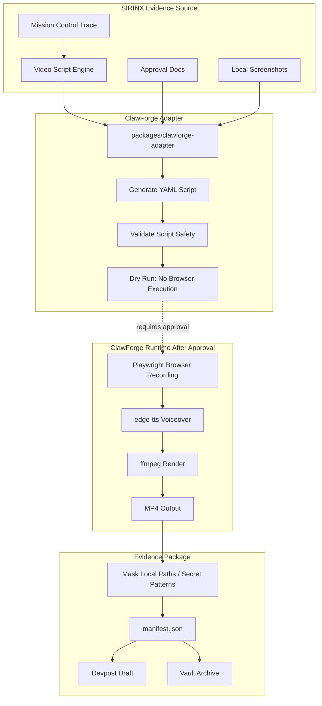

# 08 - ClawForge Demo Videos-as-Code Pipeline

```mermaid
flowchart TB
  subgraph C0["SIRINX Evidence Source"]
    TRACE["Mission Control Trace"]
    APPROVALS["Approval Docs"]
    SCREEN["Local Screenshots"]
    SCRIPT["Video Script Engine"]
  end
  subgraph C1["ClawForge Adapter"]
    ADAPTER["packages/clawforge-adapter"]
    YAML["Generate YAML Script"]
    VALIDATE["Validate Script Safety"]
    DRYRUN["Dry Run: No Browser Execution"]
  end
  subgraph C2["ClawForge Runtime After Approval"]
    PLAY["Playwright Browser Recording"]
    TTS["edge-tts Voiceover"]
    FFMPEG["ffmpeg Render"]
    MP4["MP4 Output"]
  end
  subgraph C3["Evidence Package"]
    MASK["Mask Local Paths / Secret Patterns"]
    MANIFEST["manifest.json"]
    DEVPOST["Devpost Draft"]
    VAULT["Vault Archive"]
  end
  TRACE --> SCRIPT --> ADAPTER
  APPROVALS --> ADAPTER
  SCREEN --> ADAPTER
  ADAPTER --> YAML --> VALIDATE --> DRYRUN
  DRYRUN -. "requires approval" .-> PLAY
  PLAY --> TTS --> FFMPEG --> MP4
  MP4 --> MASK --> MANIFEST --> DEVPOST
  MANIFEST --> VAULT
```

