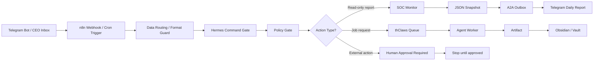

# 09 - Telegram / n8n / A2A Orchestration

```mermaid
flowchart LR
  TG["Telegram Bot / CEO Inbox"] --> WEBHOOK["n8n Webhook / Cron Trigger"]
  WEBHOOK --> ROUTE["Data Routing / Format Guard"]
  ROUTE --> HERMES["Hermes Command Gate"]
  HERMES --> POLICY["Policy Gate"]
  POLICY --> MODE{"Action Type?"}
  MODE -->|"Read-only report"| SOC["SOC Monitor"]
  MODE -->|"Job request"| TH["thClaws Queue"]
  MODE -->|"External action"| APPROVAL["Human Approval Required"]
  SOC --> SNAP["JSON Snapshot"]
  SNAP --> OUTBOX["A2A Outbox"]
  OUTBOX --> TGREPORT["Telegram Daily Report"]
  TH --> WORKER["Agent Worker"]
  WORKER --> ART["Artifact"]
  ART --> VAULT["Obsidian / Vault"]
  APPROVAL --> STOP["Stop until approved"]
```

## Local Boundary

Telegram and n8n are integration targets. Real webhook execution or message delivery is blocked until external gate approval.

