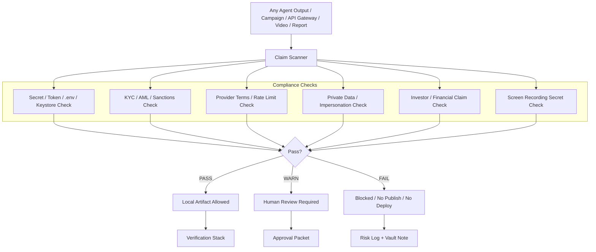

# 10 - Compliance And Safety Gate Matrix

```mermaid
flowchart TB
  INPUT["Any Agent Output / Campaign / API Gateway / Video / Report"] --> CLAIM["Claim Scanner"]
  subgraph CHECKS["Compliance Checks"]
    SECRET["Secret / Token / .env / Keystore Check"]
    KYC["KYC / AML / Sanctions Check"]
    PROVIDER["Provider Terms / Rate Limit Check"]
    PRIVACY["Private Data / Impersonation Check"]
    FINANCE["Investor / Financial Claim Check"]
    RECORDING["Screen Recording Secret Check"]
  end
  CLAIM --> SECRET
  CLAIM --> KYC
  CLAIM --> PROVIDER
  CLAIM --> PRIVACY
  CLAIM --> FINANCE
  CLAIM --> RECORDING
  SECRET --> DECIDE{"Pass?"}
  KYC --> DECIDE
  PROVIDER --> DECIDE
  PRIVACY --> DECIDE
  FINANCE --> DECIDE
  RECORDING --> DECIDE
  DECIDE -->|"PASS"| LOCAL["Local Artifact Allowed"]
  DECIDE -->|"WARN"| REVIEW["Human Review Required"]
  DECIDE -->|"FAIL"| BLOCK["Blocked / No Publish / No Deploy"]
  REVIEW --> APPROVAL["Approval Packet"]
  BLOCK --> LOG["Risk Log + Vault Note"]
  LOCAL --> VERIFY["Verification Stack"]
```

