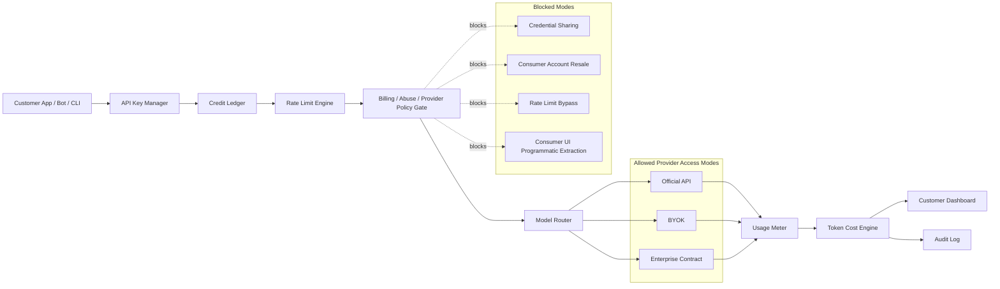

# 11 - AI Access Gateway / Credit / Rate Limit

```mermaid
flowchart LR
  APP["Customer App / Bot / CLI"] --> KEY["API Key Manager"]
  KEY --> CREDIT["Credit Ledger"]
  CREDIT --> LIMIT["Rate Limit Engine"]
  LIMIT --> POLICY["Billing / Abuse / Provider Policy Gate"]
  POLICY --> ROUTER["Model Router"]
  subgraph PROVIDERS["Allowed Provider Access Modes"]
    OFFICIAL["Official API"]
    BYOK["BYOK"]
    ENTERPRISE["Enterprise Contract"]
  end
  subgraph BLOCKED["Blocked Modes"]
    SHARE["Credential Sharing"]
    RESELL["Consumer Account Resale"]
    BYPASS["Rate Limit Bypass"]
    SCRAPE["Consumer UI Programmatic Extraction"]
  end
  ROUTER --> OFFICIAL
  ROUTER --> BYOK
  ROUTER --> ENTERPRISE
  POLICY -. blocks .-> SHARE
  POLICY -. blocks .-> RESELL
  POLICY -. blocks .-> BYPASS
  POLICY -. blocks .-> SCRAPE
  OFFICIAL --> USAGE["Usage Meter"]
  BYOK --> USAGE
  ENTERPRISE --> USAGE
  USAGE --> COST["Token Cost Engine"]
  COST --> DASH["Customer Dashboard"]
  COST --> AUDIT["Audit Log"]
```

