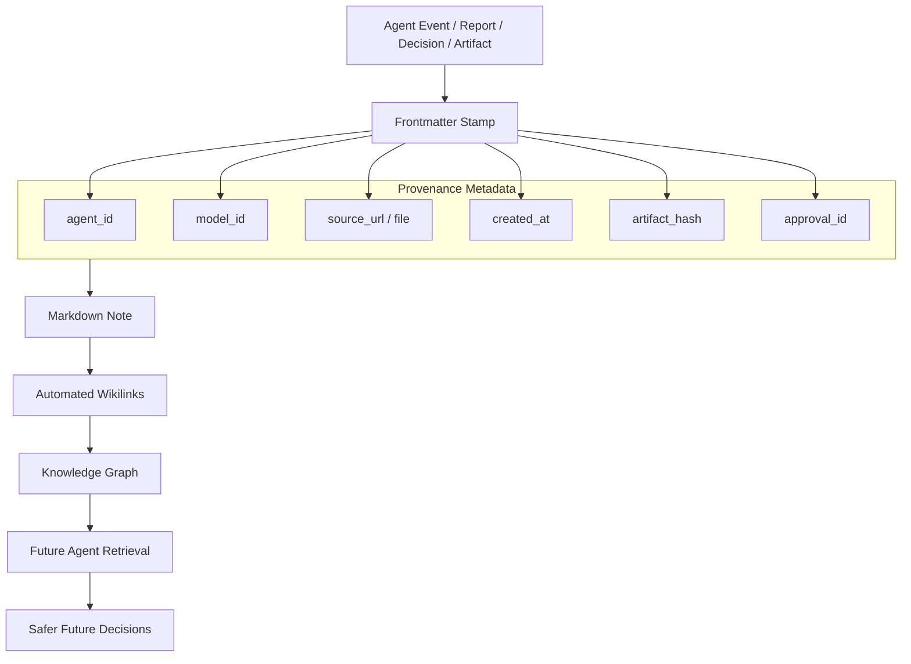

# 12 - Obsidian Wiki / Provenance / Knowledge Graph

```mermaid
flowchart TB
  EVENT["Agent Event / Report / Decision / Artifact"] --> FRONT["Frontmatter Stamp"]
  subgraph META["Provenance Metadata"]
    AGENT["agent_id"]
    MODEL["model_id"]
    SOURCE["source_url / file"]
    TIME["created_at"]
    HASH["artifact_hash"]
    APPROVAL["approval_id"]
  end
  FRONT --> AGENT
  FRONT --> MODEL
  FRONT --> SOURCE
  FRONT --> TIME
  FRONT --> HASH
  FRONT --> APPROVAL
  META --> MD["Markdown Note"]
  MD --> LINK["Automated Wikilinks"]
  LINK --> GRAPH["Knowledge Graph"]
  GRAPH --> RETRIEVAL["Future Agent Retrieval"]
  RETRIEVAL --> DECISION["Safer Future Decisions"]
```

