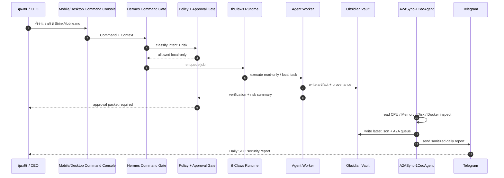

# 13 - Full Lifecycle: CEO Command To Telegram SOC

```mermaid
sequenceDiagram
  autonumber
  participant CEO as คุณต้น / CEO
  participant Console as Mobile/Desktop Command Console
  participant Hermes as Hermes Command Gate
  participant Policy as Policy + Approval Gate
  participant Runtime as thClaws Runtime
  participant Worker as Agent Worker
  participant Vault as Obsidian Vault
  participant SOC as A2ASync-1CeoAgent
  participant Telegram as Telegram
  CEO->>Console: สั่งงาน / แนบ SirinxMobile.md
  Console->>Hermes: Command + Context
  Hermes->>Policy: classify intent + risk
  Policy-->>Hermes: allowed local-only
  Hermes->>Runtime: enqueue job
  Runtime->>Worker: execute read-only / local task
  Worker->>Vault: write artifact + provenance
  Worker->>Policy: verification + risk summary
  Policy-->>CEO: approval packet required
  SOC->>SOC: read CPU / Memory / Disk / Docker inspect
  SOC->>Vault: write latest.json + A2A queue
  SOC->>Telegram: send sanitized daily report
  Telegram-->>CEO: Daily SOC security report
```

## Local Boundary

The Telegram send step is a future approved delivery action. Current local implementation must stop at the approval packet.

