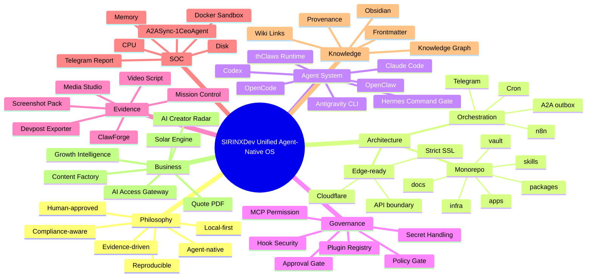

# 14 - Professor-Level Concept Map

```mermaid
mindmap
  root((SIRINXDev Unified Agent-Native OS))
    Philosophy
      Local-first
      Human-approved
      Agent-native
      Evidence-driven
      Compliance-aware
      Reproducible
    Architecture
      Monorepo
        apps
        packages
        skills
        docs
        vault
        infra
      Edge-ready
        Cloudflare
        Strict SSL
        API boundary
      Orchestration
        n8n
        Telegram
        Cron
        A2A outbox
    Agent System
      Hermes Command Gate
      thClaws Runtime
      OpenClaw
      Codex
      OpenCode
      Claude Code
      Antigravity CLI
    Governance
      Policy Gate
      Approval Gate
      Secret Handling
      MCP Permission
      Plugin Registry
      Hook Security
    Evidence
      Mission Control
      Media Studio
      ClawForge
      Devpost Exporter
      Screenshot Pack
      Video Script
    SOC
      CPU
      Memory
      Disk
      Docker Sandbox
      Telegram Report
      A2ASync-1CeoAgent
    Knowledge
      Obsidian
      Frontmatter
      Provenance
      Wiki Links
      Knowledge Graph
    Business
      Content Factory
      AI Access Gateway
      Quote PDF
      Growth Intelligence
      Solar Engine
      AI Creator Radar
```

