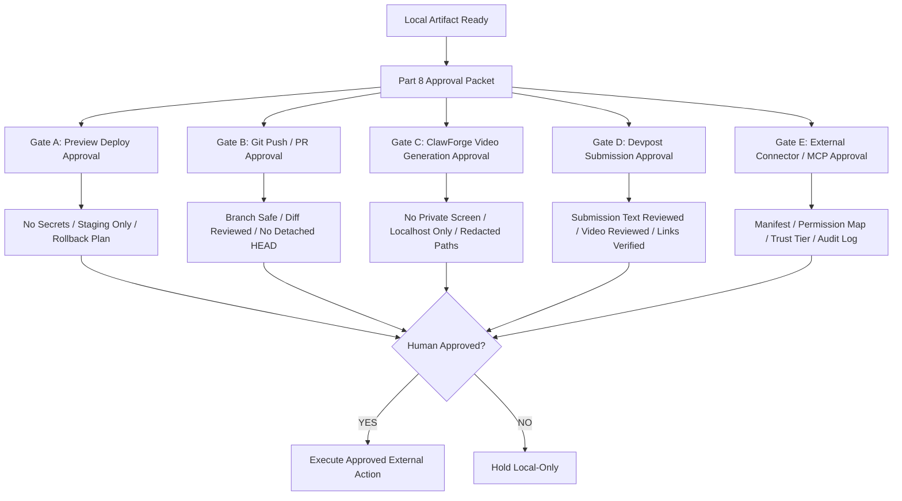

# 15 - Deployment Approval Gates

```mermaid
flowchart TB
  READY["Local Artifact Ready"] --> PACKET["Part 8 Approval Packet"]
  PACKET --> G1["Gate A: Preview Deploy Approval"]
  PACKET --> G2["Gate B: Git Push / PR Approval"]
  PACKET --> G3["Gate C: ClawForge Video Generation Approval"]
  PACKET --> G4["Gate D: Devpost Submission Approval"]
  PACKET --> G5["Gate E: External Connector / MCP Approval"]
  G1 --> CHECK1["No Secrets / Staging Only / Rollback Plan"]
  G2 --> CHECK2["Branch Safe / Diff Reviewed / No Detached HEAD"]
  G3 --> CHECK3["No Private Screen / Localhost Only / Redacted Paths"]
  G4 --> CHECK4["Submission Text Reviewed / Video Reviewed / Links Verified"]
  G5 --> CHECK5["Manifest / Permission Map / Trust Tier / Audit Log"]
  CHECK1 --> DECIDE{"Human Approved?"}
  CHECK2 --> DECIDE
  CHECK3 --> DECIDE
  CHECK4 --> DECIDE
  CHECK5 --> DECIDE
  DECIDE -->|"YES"| EXECUTE["Execute Approved External Action"]
  DECIDE -->|"NO"| HOLD["Hold Local-Only"]
```

