# 17 - A2ASync-1CeoAgent Install Path

```mermaid
flowchart LR
  ZIP["ghost-claw-zenith-soc-a2async.zip"] --> UNZIP["unzip on Ubuntu Host"]
  UNZIP --> VENV["python3 -m venv .venv"]
  VENV --> PIP["pip install -r requirements.txt"]
  PIP --> ENV["configure /etc/sirinx/soc.env"]
  ENV --> DRY["python scripts/soc_monitor.py --dry-run"]
  DRY --> SEND["python scripts/soc_monitor.py --send --queue-a2a"]
  SEND --> TIMER["install systemd timer"]
  TIMER --> ACTIVE["A2ASYNC-1CEOAGENT DAILY SOC ACTIVE"]
  ACTIVE --> STOP["READ-ONLY BASELINE - NO MUTATION"]
```

## Local Boundary

Only dry-run validation is allowed from this repo. `--send`, systemd installation, and host mutation require explicit install approval on the target host.

