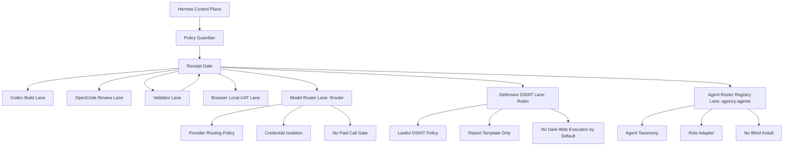

# GhostClaw External Agent Tooling Addendum V1.3

Status: `CLASSIFIED / POLICY-GATED / READY_FOR_REGISTRY`
Mission ID: `GC-EXTERNAL-AGENT-TOOLS-V1-3-20260630-001`

## Scope

This addendum registers three external repositories as policy-gated references:

- `decolua/9router`
- `apurvsinghgautam/robin`
- `msitarzewski/agency-agents`

It does not install, execute, clone, connect providers, access dark-web
resources, call LLM providers, read secrets, deploy, push, or mutate production
systems.

## Architecture Update

## Tool Registry

| Tool | Lane | Gate | Allowed Use | Blocked Use |
| --- | --- | --- | --- | --- |
| 9router | Model Router / Provider Gateway | Yellow/Red | local router research, provider abstraction draft, fallback policy design | storing secrets, provider ToS bypass, automatic paid calls, multi-account abuse |
| Robin | Defensive OSINT / Threat Intel | Red | lawful report template, risk matrix, offline synthetic workflow | dark-web crawling, credential discovery, leaked data handling, de-anonymization |
| agency-agents | Agent Roster / Persona Registry | Green/Yellow | read-only taxonomy, role templates, GhostClaw adapter | blind install, script execution, imported tool override |

## Final Integration Verdict

- 9router: add as Model Router Gateway candidate, do not connect provider keys.
- Robin: add as Defensive OSINT report-only reference, execution disabled.
- agency-agents: add as Agent Roster Registry reference, curated import only.
- Policy Guardian remains above all three tools.
