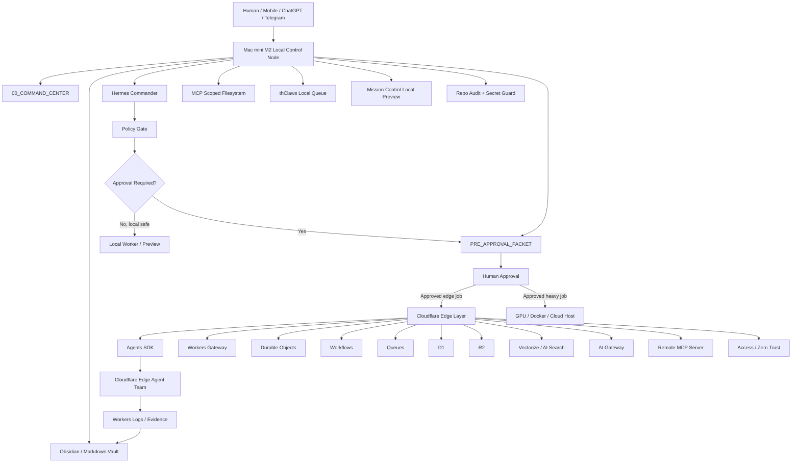

# SIRINXDev Unified Agent-Native OS v8.2

Status: LOCKED LOCAL-ONLY PLAN  
Codename: M2-First Control Node + Cloudflare Edge Agent Team  
Date: 2026-05-30  
Source boundary: user-provided v8.2 architecture plus official Cloudflare documentation reviewed on 2026-05-30. No Cloudflare account, token, API, deploy, DNS, GitHub, Supabase, ClickUp, or Notion mutation was performed.

## Decision

SIRINXDev v8.2 is now the current target architecture:

- Mac mini M2 is the local control node for command, memory, approval, evidence, scoped filesystem, local queue, and local preview.
- Cloudflare is the edge execution layer only after a `PRE_APPROVAL_PACKET` and human approval.
- GPU, Docker, or cloud hosts are heavy execution targets only after approval.
- Human operator remains the final production gate.

Cloudflare does not replace the Mac mini M2. It becomes a governed edge runtime behind Access, approval IDs, private-by-default storage, scoped MCP, logs, and rollback plans.

## Official Documentation Anchors

| Area | Current docs anchor | SIRINX use |
| --- | --- | --- |
| Cloudflare Agents SDK | https://developers.cloudflare.com/agents/ | Stateful edge agent runtime backed by Durable Objects |
| Agent tools / sub-agents | https://developers.cloudflare.com/agents/api-reference/agent-tools/ and https://developers.cloudflare.com/agents/api-reference/sub-agents/ | Edge sub-agent team after approval |
| Workflows | https://developers.cloudflare.com/workflows/ | Durable multi-step jobs with retries, sleep, and external-event waits |
| Queues | https://developers.cloudflare.com/queues/configuration/batching-retries/ | Async jobs, retries, delay, and DLQ |
| D1 / Workers databases | https://developers.cloudflare.com/workers/databases/connecting-to-databases/ | SQL state for runs, approvals, audit events |
| R2 | https://developers.cloudflare.com/r2/how-r2-works/ | Private evidence and artifact storage |
| Vectorize | https://developers.cloudflare.com/vectorize/ | Retrieval memory for policy and project documents |
| AI Gateway | https://developers.cloudflare.com/ai-gateway/configuration/caching/ | Model traffic visibility, cache, rate/cost controls |
| Access service tokens | https://developers.cloudflare.com/cloudflare-one/access-controls/service-credentials/service-tokens/ | Machine-to-machine access for private surfaces |
| Workers secrets | https://developers.cloudflare.com/workers/configuration/secrets/ | Sensitive values must not live in Wrangler vars or source |
| Workers Logs | https://developers.cloudflare.com/workers/observability/logs/workers-logs/ | Evidence, invocation logs, custom logs, errors |
| Remote MCP transport | https://developers.cloudflare.com/agents/model-context-protocol/transport/ | Streamable HTTP for remote MCP, auth required |

## Architecture

## Node Policy

| Node | Role | Allowed before approval | Blocked before approval |
| --- | --- | --- | --- |
| Human Operator | Final production gate | Approve, reject, request revision | None |
| Mac mini M2 | Local brain and control node | Inspect, draft, validate, local preview, evidence | Public tunnel, deploy, production write |
| 00_COMMAND_CENTER | Command ledger | Project state, rules, validation matrix, packets | Secret values |
| Obsidian / Markdown | Long-term memory | Distilled decisions and provenance | Tokens, raw credentials, private endpoints |
| Hermes Commander | Intent router and policy gate | Local routing, skill selection, audit trail | External mutation without approval |
| MCP Scoped Filesystem | Tool boundary | Approved repo root only | `/`, home directory, Downloads, Desktop, whole-machine scan |
| thClaws | Lightweight local queue | Queued local jobs and logs | Heavy swarm by default |
| Cloudflare Edge | Approved edge runtime | None until packet approval | Deploy, DNS, Access, secrets, MCP mutation |
| GPU / Docker / Cloud | Heavy execution | None until packet approval | Heavy job launch without packet |

## Cloudflare Edge Team

Initial edge team is deliberately small:

| Agent | Runtime | Responsibility | Forbidden |
| --- | --- | --- | --- |
| EdgeOrchestratorAgent | Agents SDK + Durable Object | Receive approved jobs, dispatch sub-agents, summarize evidence | Deploy, DNS edit, public send |
| ComplianceGuardAgent | Agents SDK + D1 | Check policy, secrets, claims, mutation risk | File or cloud mutation |
| EvidencePackagerAgent | Agents SDK + R2/D1 | Package validation logs, screenshots, cost, rollback | Public artifact publication |
| ResearchAgent | Agents SDK + Vectorize | Read-only research packet | Login automation, ToS bypass |
| SEOAEOAgent | Agents SDK + Vectorize | Public content brief and schema draft | Production publish |
| DeploymentPlannerAgent | Agents SDK | Draft deployment and rollback plan | `wrangler deploy` |
| NotificationDraftAgent | Agents SDK | Draft outbound messages | Real send |
| MemoryWriterAgent | Agents SDK | Distilled memory and source map | Raw secret logging |

## Phase Lock

1. M2 Baseline Audit.
2. SIRINXDev Skeleton and command center.
3. Hermes plus scoped MCP.
4. Obsidian memory.
5. thClaws local queue.
6. Mission Control local preview.
7. Secret Guard.
8. PRE_APPROVAL_PACKET.
9. Cloudflare research packet.
10. Cloudflare local skeleton.
11. Local edge-agent prototype.
12. Cloudflare Access plan.
13. Cloudflare approval packet.
14. Private dev deploy only after approval.
15. M2 to Cloudflare integration.
16. GPU/cloud/production expansion only after approval.

## Locked Guardrails

- Cloudflare endpoints are private-first except the public marketing site.
- `dev.sirinx.co`, `agents.sirinx.co`, `mcp.sirinx.co`, `n8n.sirinx.co`, and `logs.sirinx.co` require Access before real use.
- Remote MCP must use auth and scoped permissions.
- Cloudflare API MCP is read-only until an approval ID is attached.
- No tokens in `wrangler.toml`, source, docs, Obsidian, logs, or chat.
- R2 artifacts are private-by-default.
- D1 must separate dev, staging, and production.
- Every Cloudflare run must include `correlation_id`, approval ID, evidence path, and rollback path.

