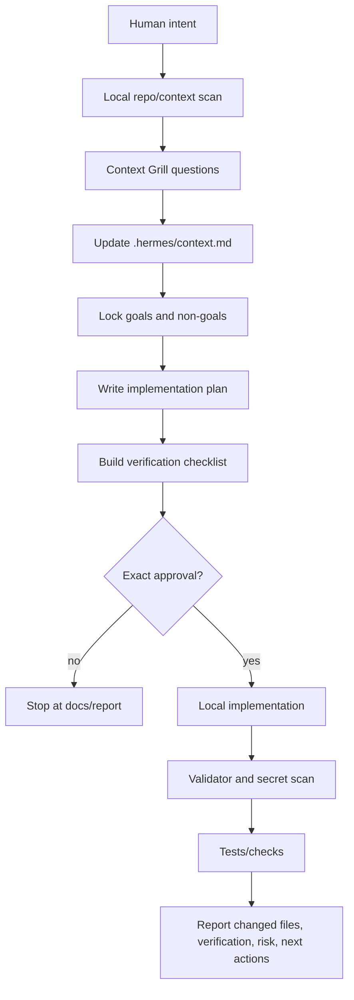

# SIRINX Context Engineering Gate - Grill With Docs Pattern

Status: LOCAL-ONLY KNOWLEDGE INTEGRATION  
Date: 2026-05-28  
Source boundary: user-provided video analysis and screenshot prompt framework. The video itself was not fetched or replayed in this run.

## Purpose

Convert the `context.md` lesson from the MilerDev video analysis into a SIRINX operating pattern. The goal is to stop agent drift before source-code work starts by forcing every non-trivial task through a context interview, non-goal lock, implementation plan, approval gate, and verification gate.

## Decision

Adopt `Context Engineering Gate` as a required planning layer for SIRINXDev / Hermes / thClaws / OpenClaw work.

The gate maps the video lesson directly into SIRINX:

| Video concept | SIRINX equivalent | Required artifact |
| --- | --- | --- |
| `context.md` keeps AI aligned | `.hermes/context.md` is the local project memory | Updated context snapshot |
| Grill with Docs interviews the user | SIRINX Context Grill questions | Requirements and non-goals |
| Superpowers visual validation | Local preview or diagram before UI implementation | Screenshot, Mermaid, or static preview |
| Implementation plan after context | `docs/superpowers/plans/*.md` | Stepwise plan with files and verification |
| Inline execution | Local-only implementation after exact approval | Verified diff, no external mutation |
| Avoid overbuilding v1 | Explicit non-goals | Defer/reject matrix |

## Operating Rule

No Context, No Plan, No Code.

For SIRINX this expands to:

1. No context update before planning.
2. No source edit before plan.
3. No implementation before exact approval.
4. No external action before separate external approval.
5. No completion claim before fresh verification evidence.

## Context Engineering Loop



## SIRINX Context Grill Question Bank

Use these questions before any new feature, repo intake, agent node, MCP bridge, dashboard, or workflow automation.

| Area | Required question | Why it matters |
| --- | --- | --- |
| Mission | What user-visible result must exist at the end? | Prevents vague agent work |
| Scope | Which files, apps, or directories are in scope? | Prevents full-machine scans |
| Non-goals | What must not be built in this phase? | Prevents overbuilding |
| Data boundary | What data must never leave local disk? | Protects secrets and private context |
| Runtime | Is this docs-only, local preview, local API, or external activation? | Controls risk level |
| UI | Does this need a visual layout, Mermaid diagram, or browser preview before code? | Reduces design ambiguity |
| Integrations | Which MCP/plugin/webhook/provider lanes are allowed? | Enforces permission mapping |
| Approval | What exact phrase unlocks implementation or mutation? | Makes gate auditable |
| Verification | Which command proves the result? | Blocks completion-by-assumption |
| Rollback | What file backup, branch, or revert path exists? | Keeps changes reversible |

## Minimum Context Schema

Every major SIRINX task should have these fields in `.hermes/context.md` or a linked plan/report:

```markdown
## Task Context

- Mission:
- Current phase:
- In scope:
- Out of scope:
- Approved roots:
- Blocked actions:
- Required approval phrase:
- Data and secret policy:
- Runtime policy:
- Expected artifacts:
- Verification commands:
- Human review checkpoint:
```

## Accept / Defer / Reject Matrix

When an agent suggests a feature, classify it before accepting.

| Classification | Criteria | Action |
| --- | --- | --- |
| Accept | Required for the current definition of done | Add to plan and verification |
| Defer | Useful but not needed for this phase | Record in next actions |
| Reject | Increases risk, violates boundary, or conflicts with source of truth | Record as non-goal |

Examples for SIRINX:

| Suggestion | Classification | Reason |
| --- | --- | --- |
| Add `.hermes/reports` status file | Accept | Local artifact, improves audit trail |
| Add progress tracking UI before Night Watch is stable | Defer | Nice to have, not foundation-critical |
| Register external MCP connector without manifest | Reject | Violates permission policy |
| Clone all high-star repos and run installers | Reject | Supply-chain and blast-radius risk |

## SIRINX Integration Points

### Hermes TUI

Hermes should treat the context gate as the first skill step for non-trivial work. The skill should gather context, update local memory, and stop if implementation is not explicitly approved.

### thClaws

thClaws jobs should include a context hash or report path in every queued task. A job without context evidence should be rejected or routed to clarification.

### OpenClaw / Codex Worker

Developer workers should read `.hermes/context.md`, the relevant grid file, and the implementation plan before making source changes.

### Obsidian

Obsidian receives concise decision summaries only. It should not receive secrets, full logs, provider tokens, or large raw transcripts.

### Validator Shield

Generated code and workflow snippets must pass validator, secret scan, and diff review before execution.

## Definition Of Done For The Gate

- Context artifact exists.
- Non-goals are explicit.
- Runtime boundary is explicit.
- Approval phrase is explicit.
- Verification command is explicit.
- Report is written under `.hermes/reports`.
- Obsidian digest receives a concise note if writable.
- No install, deploy, push, connector activation, external SaaS write, or provider execution occurs unless separately approved.

## Current Local Application

This run applies the gate as documentation and operating process only. It does not install `Grill with Docs`, clone Superpowers repositories, run provider models, or change Hermes gateway behavior.

