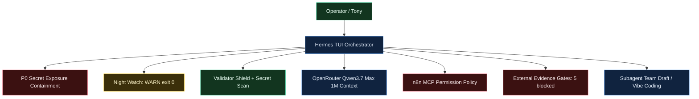
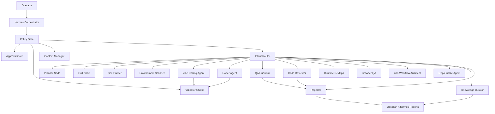
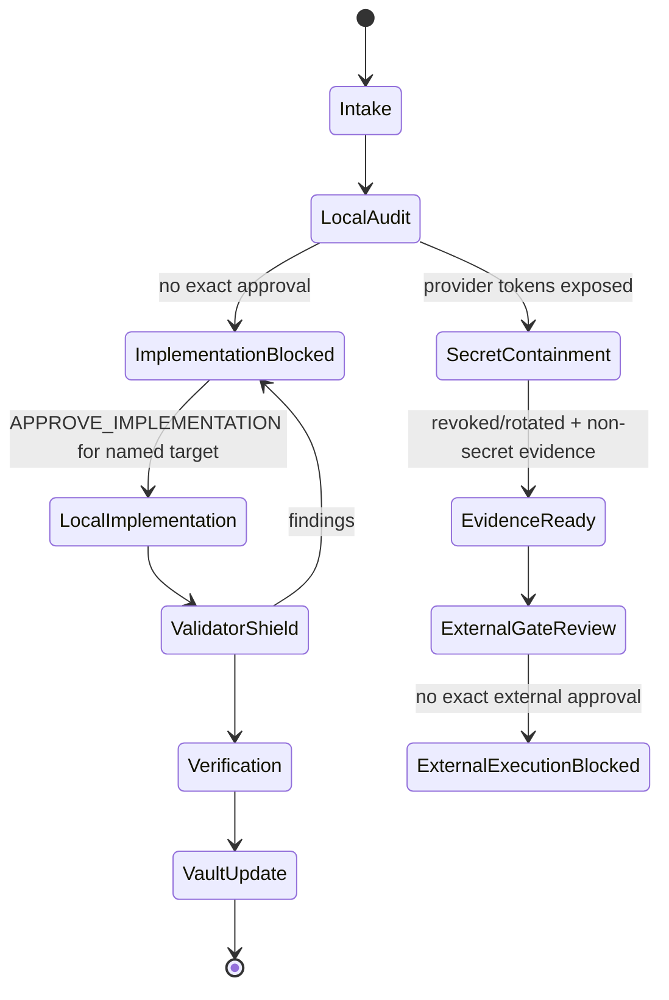
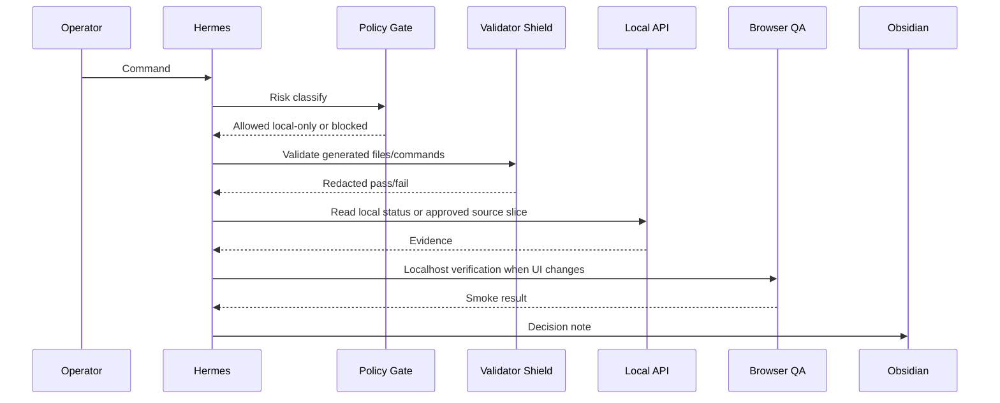

# SIRINX Godmode Grid Mermaid Syntax - 2026-05-28

Status: LOCAL-ONLY SYNTAX REFERENCE

This reference stores reusable Mermaid syntax for SIRINX Godmode / Vibe Coding planning and handoff.

## Master Continuation Grid

## All-Node Topology

## Gate State Machine

## Execution Sequence

## Permission Grid

| Class | Meaning | Status |
| --- | --- | --- |
| A0 | Read repo docs/state | allowed |
| A1 | Local read-only status checks | allowed |
| A2 | Docs/reports/state/Obsidian updates | allowed |
| A3 | Implementation packets and dry-run plans | allowed |
| A4 | Source changes for named target | blocked until exact approval |
| A5 | Install, clone, MCP register, provider call, send, deploy, push, publish | blocked until gate-specific approval |

## Reuse Rule

Use these snippets in future grid files only when the work remains local-only and approval-gated. For source/API/dashboard work, create or update tests before implementation and run Validator Shield plus secret scan before completion.

