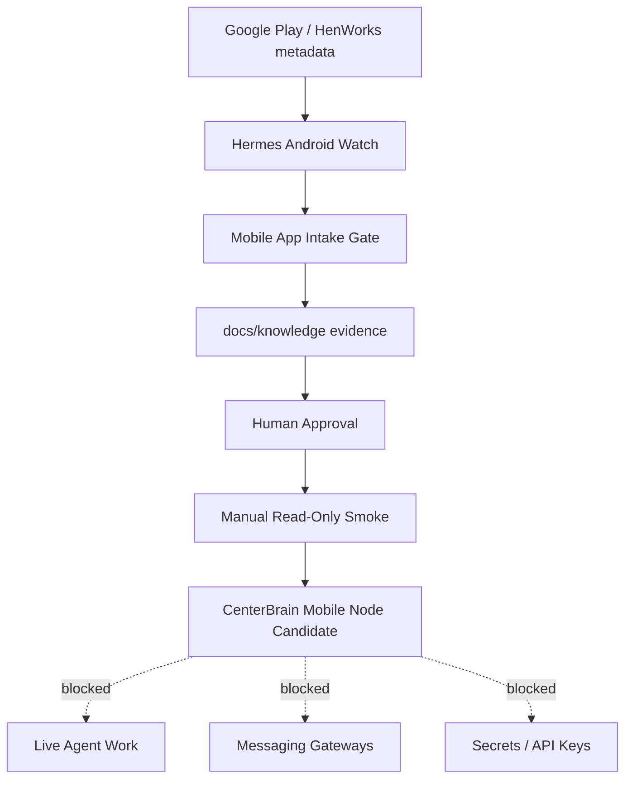

# SIRINX Hermes Agent Android Research

Date: 2026-05-27
Status: research captured, local-only

## Subject

Hermes Agent - Android

Package:

```text
com.hermesagent.android
```

Developer:

```text
Hen Works / HenWorks
```

## Source Tiers

### Higher Confidence

- Google Play listing: `https://play.google.com/store/apps/details?id=com.hermesagent.android`
- HenWorks website: `https://henworks.com/`
- HenWorks privacy policy: `https://henworks.com/privacy.html`
- NousResearch Hermes Agent release/docs:
  - `https://github.com/NousResearch/hermes-agent/releases`
  - `https://github.com/NousResearch/hermes-agent/blob/main/website/docs/getting-started/installation.md`
  - `https://github.com/NousResearch/hermes-agent/blob/main/website/docs/reference/faq.md`

### Lower Confidence / Cross-Check Only

- APKPure / APKCombo / AppBrain mirrors and app-intelligence pages.
- Reddit/community posts.
- Third-party Android bridge repos.

## Current Public Facts

The Play Store listing identifies the app as:

```text
Hermes Agent - Android
Developer: Hen Works
Contains ads + in-app purchases
Downloads: 1K+
Rating observed: 4.3 star, 320 reviews
Updated: May 18, 2026
```

Play Store feature claims:

- multi-model support: OpenAI, Anthropic, Google, local models via LiteRT
- built-in Linux terminal with bash, Python, and git
- code execution directly on device
- gateway connections to Telegram, Slack, and Discord
- web search and extraction
- image generation through Fal.ai
- Edge TTS
- persistent memory
- multiple resumable sessions
- web dashboard for sessions, tools, and memory
- one-time Hermes Pro purchase to remove ads
- bring-your-own API key

Latest Play Store changelog observed:

```text
v1.0.1 - Stability fix
- Fixed bootstrap installation failing at Step 6/6 on devices without prior Termux Python.
- Fixed Home tab incorrectly showing API not configured after ChatGPT Codex OAuth login.
- Fixed ANR app freeze when opening Settings or after long Hermes sessions.
```

Third-party APK mirrors still commonly show `1.0.0`, `May 8, 2026`, and package hashes for mirror artifacts. Treat mirror data as stale unless verified against Google Play or vendor release notes.

## Related Hermes Agent Ecosystem Facts

NousResearch Hermes Agent v0.9.0 / v2026.4.13 was an Android-relevant release:

- Termux / Android support.
- local web dashboard.
- background process monitoring.
- iMessage and WeChat support.
- security hardening across multiple platform surfaces.

Official Hermes docs state:

- Android support is available through Termux.
- Android install path uses Termux packages, Python venv, Android API-level handling, and Termux-specific extras.
- full extra sets have Android caveats.
- conversations, memory, and skills live locally under `~/.hermes/` for standard Hermes Agent.

The HenWorks Play Store app is not the same thing as the raw Termux install path. It appears to package a more guided Android application experience around the Hermes Agent concept.

## Evidence Gaps

- No public source repo for `com.hermesagent.android` was confirmed during this pass.
- HenWorks has an open source `openclaw-android` repository, but that is an Opclaw/OpenClaw Android product, not confirmed source for Hermes Agent - Android.
- The HenWorks general privacy policy lists TextLen and Opclaw details, but does not provide a Hermes Agent - Android product-specific section in the observed page.
- Play Store data safety says no shared and no collected data, but the app also has ads, in-app purchases, gateway messaging, BYO API keys, and provider calls. Treat the practical data path as provider-dependent until verified on-device.

## SIRINX Integration Classification

Classification:

```text
mobile-agent-runtime-candidate
```

Risk level:

```text
high until sandboxed and audited
```

Reason:

The app claims terminal access, code execution, background service behavior, web search, image generation, external provider calls, and messaging gateways. That makes it a potential mobile execution node, not a passive chat app.

## Allowed SIRINXDev Use Now

- Track as research signal.
- Add to CenterBrain mobile-node candidate list.
- Use as manual-only mobile smoke candidate.
- Build local-only dashboard status for package identity and evidence checklist.
- Use Google Play / HenWorks public metadata only.

## Blocked Until Separate Approval

- Install on production phone.
- Sideload APK/XAPK.
- Enter API keys.
- Enable Telegram, Slack, Discord, or any messaging gateway.
- Use OAuth login for Codex or provider access.
- Give it access to SIRINX repos, customer data, private chats, or secrets.
- Run scripts against SIRINX infrastructure.
- Connect it to CenterBrain as a live worker.
- Use it for deploy, push, publish, customer messaging, scraping, or paid API calls.

## Recommended SIRINX Architecture



## Proposed Next Build

```text
Part 7.15 - Hermes Android Mobile App Intake Gate
```

Endpoints:

```text
GET  /api/mobile-app-intake-gate
POST /api/mobile-app-intake-gate/review/dry-run
```

Minimum test contract:

- identifies package `com.hermesagent.android`
- returns source confidence and evidence gaps
- blocks install, sideload, API key entry, OAuth, gateway enablement, code execution, and messaging
- returns manual smoke checklist only
- writes no secrets and performs no external action

Stop point:

```text
HERMES ANDROID MOBILE APP INTAKE READY - LOCAL ONLY - WAITING FOR DEVICE SMOKE APPROVAL
```
