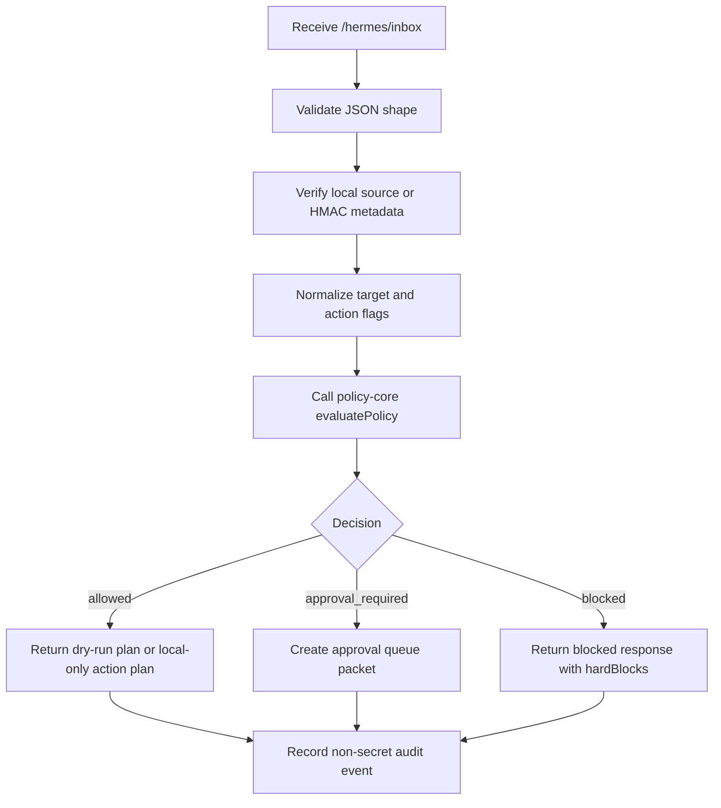

# SIRINX Hermes Inbox Contract

## Purpose

`POST /hermes/inbox` is the local command ingress for SIRINXDev Unified Project OS.

The inbox converts operator or agent requests into a normalized command packet, runs `policy-core`, records a non-secret audit event, and returns either a dry-run plan, an approval request, or a blocked decision.

This document is a design artifact only. It does not authorize Telegram, LINE, Solis, Cloudflare, GitHub, Supabase, or customer-visible execution.

## Scope

In scope:

- local HTTP contract
- request normalization
- HMAC/session authentication design
- policy-core handoff
- approval queue handoff
- audit event shape
- dry-run response shape
- test matrix

Out of scope until explicit gate evidence exists:

- Telegram send
- LINE send
- Solis API call
- Cloudflare write
- GitHub push or PR
- Supabase migration/write
- production lead creation
- arbitrary shell command execution

## Endpoint

```http
POST /hermes/inbox
Content-Type: application/json
X-SIRINX-Source: codex-local | hermes-dashboard | codex-mobile | telegram | line | scheduled-agent
X-SIRINX-Timestamp: 2026-05-20T00:00:00.000Z
X-SIRINX-Signature: hmac-sha256=<hex>
```

Phase 1 accepts only local trusted sources:

- `codex-local`
- `hermes-dashboard`

External sources are parsed only after connector evidence and signature verification exist.

## Request Body

```json
{
  "requestId": "uuid-or-stable-id",
  "source": "codex-local",
  "operator": {
    "id": "human-operator",
    "channel": "local"
  },
  "intent": {
    "type": "local-doc-write",
    "summary": "Update operating docs",
    "rawTextIncluded": false
  },
  "target": {
    "id": "docs/knowledge/SIRINX_PLAN.md",
    "system": "local-filesystem"
  },
  "action": {
    "id": "update-operating-doc",
    "type": "local-doc-write",
    "externalWrite": false,
    "productionWrite": false,
    "customerVisible": false,
    "paidApi": false,
    "destructive": false,
    "readsSecretValues": false,
    "printsSecrets": false,
    "rawChatToMemory": false
  },
  "evidence": {
    "approval": null,
    "consent": false,
    "credentialStorage": false,
    "stationMapping": false
  },
  "dryRun": true
}
```

## Normalization Rules

The inbox must derive one normalized action for `policy-core`:

```json
{
  "id": "update-operating-doc",
  "type": "local-doc-write",
  "target": "docs/knowledge/SIRINX_PLAN.md",
  "externalWrite": false,
  "productionWrite": false,
  "customerVisible": false,
  "paidApi": false,
  "destructive": false,
  "readsSecretValues": false,
  "printsSecrets": false,
  "rawChatToMemory": false
}
```

If the request references external writes, production writes, customer-visible messages, paid APIs, destructive commands, secret reads, or raw chat memory, the flags must be explicit and conservative. Unknown risk defaults to `approval_required` or `blocked`, never `allowed`.

## Policy Flow



## Decision Handling

| `policy-core` decision | HTTP status | Meaning | External writes |
| --- | --- | --- | --- |
| `allowed` | `200` | Local-only safe action or exactly approved external action. Phase 1 uses local-only only. | `false` in Phase 1 |
| `approval_required` | `202` | Exact target approval is missing. | `false` |
| `blocked` | `403` | Hard safety rule failed. | `false` |
| invalid JSON/schema | `400` | Request cannot be normalized safely. | `false` |
| auth/signature failure | `401` | Source cannot be trusted. | `false` |

## Approval Packet Shape

```json
{
  "requestId": "uuid-or-stable-id",
  "actionId": "cloudflare-main-router-deploy",
  "target": "cloudflare:main-router",
  "decision": "approval_required",
  "approvalReasons": ["external-or-production-action"],
  "requiredEvidence": [
    "exact target",
    "rollback path",
    "verification command",
    "human approval phrase"
  ],
  "externalWrites": false
}
```

## Audit Event Shape

Audit events must avoid raw chat logs and secrets.

```json
{
  "eventId": "uuid",
  "requestId": "uuid-or-stable-id",
  "source": "codex-local",
  "actionId": "update-operating-doc",
  "target": "docs/knowledge/SIRINX_PLAN.md",
  "policyVersion": "2026-05-20.policy-core.v1",
  "decision": "allowed",
  "externalWrites": false,
  "hardBlocks": [],
  "approvalReasons": [],
  "createdAt": "2026-05-20T00:00:00.000Z"
}
```

## HMAC Strategy

Phase 1 design only:

- canonical payload: `${timestamp}.${rawBody}`
- signature algorithm: `HMAC-SHA256`
- signature header: `X-SIRINX-Signature`
- timestamp skew limit: 300 seconds
- key source: local secret manager or environment reference, never printed

Implementation rule: the verifier may read whether a secret reference exists but must not print the secret value. If no local secret reference is configured, external-source inbox requests must return `401`.

## Stop Rules

Stop immediately if a request attempts:

- `.env` value read
- token/key/keystore read or print
- raw chat log memory write
- Telegram/LINE send without completed recipient/token evidence
- Solis telemetry without consent, credential storage, and station mapping evidence
- Cloudflare deploy/write without exact target approval
- database migration without migration plan and approval
- GitHub push/PR without exact branch/repo approval
- shell command execution that is destructive or target-ambiguous

## Test Matrix

| Case | Expected |
| --- | --- |
| local doc write, no secret flags | `200`, `allowed`, `externalWrites=false` |
| local `.env` read with `readsSecretValues=true` | `403`, `blocked` |
| Cloudflare deploy target, no approval | `202`, `approval_required` |
| Telegram send target mismatch approval | `202`, `approval_required` |
| Solis telemetry missing consent/storage/mapping | `403`, `blocked` |
| invalid JSON | `400`, `externalWrites=false` |
| external source without verified HMAC | `401`, `externalWrites=false` |

## Implementation Order

1. Add pure normalization and validation module.
2. Add unit tests for all matrix cases.
3. Add local `POST /api/hermes/inbox/dry-run` or equivalent preview endpoint first.
4. Wire existing approval queue only for `approval_required`.
5. Record non-secret audit events.
6. Add dashboard read-only preview.
7. Only after human gate evidence exists, design connector-specific adapters.

## Current Status

- `policy-core` exists locally and is exposed through `GET /api/policy-core`.
- Hermes inbox is not implemented.
- External adapters remain blocked.
- This design is safe to implement locally in dry-run mode next.
