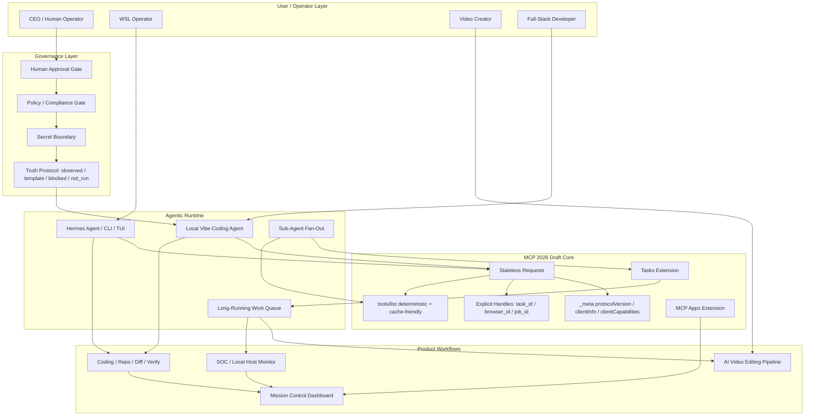
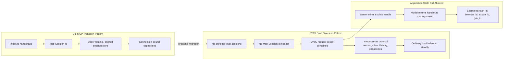
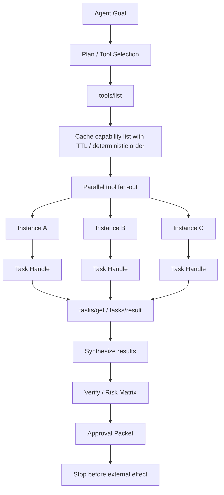
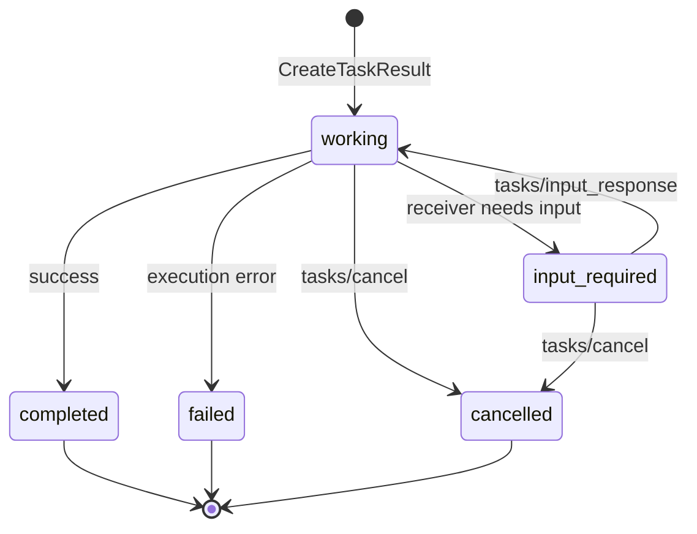
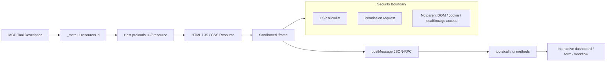
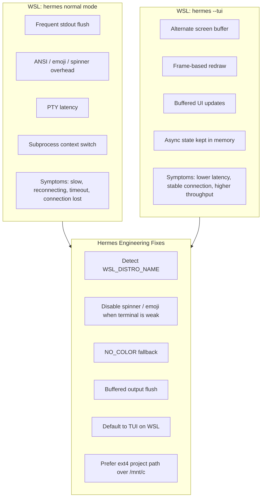
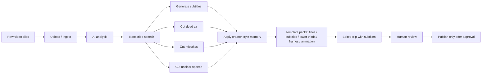
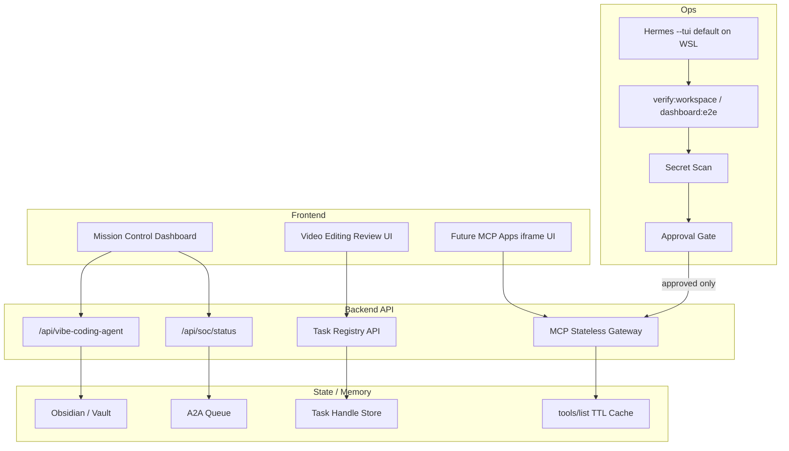
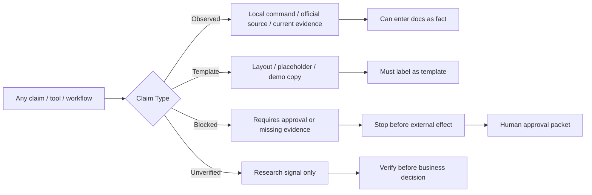

# SIRINX MCP / Hermes / Video AI / AI Apps Grid Mermaid Pack

Date: 2026-05-26
Mode: knowledge extraction, local-only, no external connector activation
Status: GRID MERMAID KNOWLEDGE EXTRACT READY - WAITING FOR IMPLEMENTATION APPROVAL

## Atomic Grid Split

Use the smaller files in `docs/grid/` for Codex execution. The master pack remains a source reference only.

- `docs/grid/README.md`
- `docs/grid/01-master-grid.md`
- `docs/grid/02-mcp-migration.md`
- `docs/grid/03-agentic-parallel.md`
- `docs/grid/04-mcp-tasks-lifecycle.md`
- `docs/grid/05-mcp-apps.md`
- `docs/grid/06-hermes-wsl.md`
- `docs/grid/07-ai-video-pipeline.md`
- `docs/grid/08-ai-apps-taxonomy.md`
- `docs/grid/09-full-stack-implementation.md`
- `docs/grid/10-risk-verification.md`

## Source Boundary

- Verified technical source: official MCP draft/spec/blog pages checked on 2026-05-26.
- Unverified social/market claims: OpenClaw star count, platform skill percentage, course conversion claims, and third-party tool rankings. Treat as research signals, not facts.
- Attached visual sources: Hermes WSL/TUI poster, Claude Code video editing course poster, AI apps taxonomy posters.

## 1. Master Grid - MCP Stateless Agent-Native OS



## 2. MCP Migration Grid - 2025-11-25 To 2026 Draft



## 3. Agentic Impact Grid



## 4. MCP Tasks Lifecycle Grid



## 5. MCP Apps Grid



## 6. Hermes WSL Performance Grid



## 7. AI Video Editing Pipeline Grid



## 8. AI Apps 2026 Taxonomy Grid

```mermaid
flowchart TB
  ROOT["AI Apps 2026 Ecosystem"]

  ROOT --> GENERAL["General Assistants"]
  GENERAL --> CLAUDE["Claude"]
  GENERAL --> CHATGPT["ChatGPT"]
  GENERAL --> PERP["Perplexity"]

  ROOT --> DEVTOOLS["Development / Programming"]
  DEVTOOLS --> CURSOR["Cursor"]
  DEVTOOLS --> LOVABLE["Lovable"]
  DEVTOOLS --> REPLIT["Replit"]
  DEVTOOLS --> BOLT["Bolt"]
  DEVTOOLS --> CLCODE["Claude Code"]

  ROOT --> CONTENT["Content Creation"]
  CONTENT --> HEYGEN["HeyGen"]
  CONTENT --> SYNTH["Synthesia"]
  CONTENT --> DESCRIPT["Descript"]
  CONTENT --> OPUS["Opus Clip"]
  CONTENT --> BEEHIIV["Beehiiv"]
  CONTENT --> KAPWING["Kapwing"]

  ROOT --> PRODUCTIVITY["Productivity"]
  PRODUCTIVITY --> GRAM["Grammarly"]
  PRODUCTIVITY --> NOTEBOOK["NotebookLM"]
  PRODUCTIVITY --> NOTION["Notion AI"]
  PRODUCTIVITY --> GAMMA["Gamma"]
  PRODUCTIVITY --> GRANOLA["Granola"]
  PRODUCTIVITY --> OTTER["Otter AI"]
  PRODUCTIVITY --> WISPR["Wispr Flow"]

  ROOT --> CREATIVE["Creativity"]
  CREATIVE --> ELEVEN["ElevenLabs"]
  CREATIVE --> SUNO["Suno"]
  CREATIVE --> MID["Midjourney"]
  CREATIVE --> RUNWAY["Runway"]
  CREATIVE --> KLING["Kling"]
  CREATIVE --> PIKA["Pika Labs"]
  CREATIVE --> IDEO["Ideogram"]
  CREATIVE --> CANVA["Canva"]
  CREATIVE --> VEO["Google Veo"]
  CREATIVE --> FIREFLY["Adobe Firefly"]

  ROOT --> AUTO["Automation / Integration"]
  AUTO --> N8N["n8n"]
  AUTO --> ZAP["Zapier"]
  AUTO --> LINDY["Lindy AI"]
  AUTO --> CHATBASE["Chatbase"]
  AUTO --> GEMINI["Gemini"]
  AUTO --> MANUS["Manus AI"]
  AUTO --> MAKE["Make"]
  AUTO --> CLAY["Clay"]
```



## 9. Full-Stack Implementation Grid For SIRINX



## 10. Risk / Verification Grid



## Verified MCP Notes

- The official draft changelog says the draft removes protocol-level sessions and `Mcp-Session-Id`, and shifts request identity/capability data into `_meta`.
- The draft overview requires per-request `io.modelcontextprotocol/*` fields.
- The Tasks draft defines durable task state, `taskId`, terminal states, `tasks/get`, `tasks/result`, and cancellation behavior.
- MCP Apps are an extension that renders HTML UI resources in sandboxed iframes and communicates through JSON-RPC/postMessage.

## Stop Point

```text
GRID MERMAID KNOWLEDGE EXTRACT READY - WAITING FOR IMPLEMENTATION APPROVAL
```
