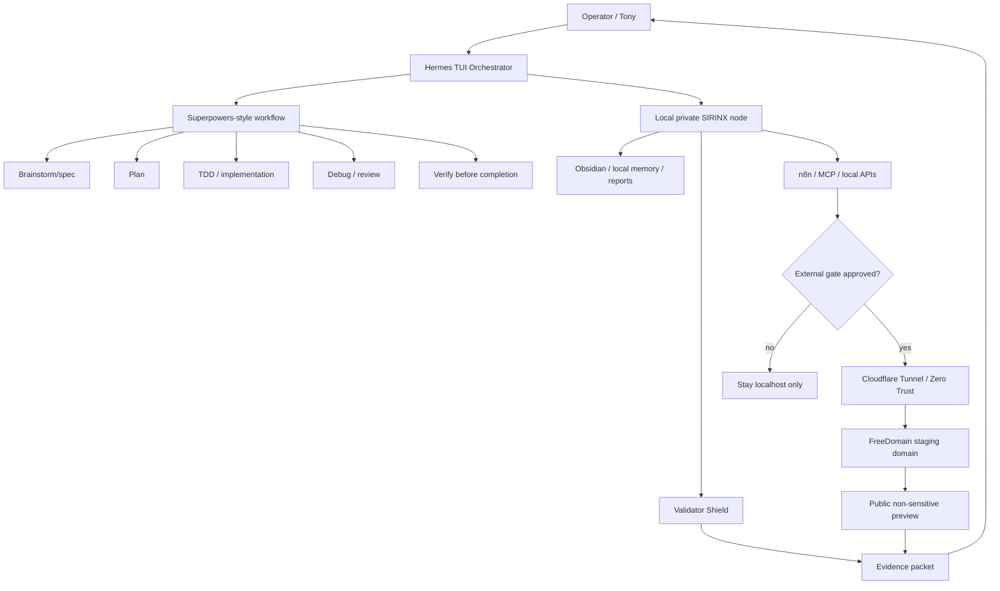

# SIRINX Repo Analysis: obra/superpowers + DigitalPlatDev/FreeDomain - 2026-05-28

Status: VERIFIED PUBLIC SOURCE REVIEW, NO CLONE, NO INSTALL, NO EXTERNAL MUTATION

## Purpose

Apply the uploaded "world-class video analyst and learning strategist" framework to software repositories instead of video. The goal is to extract maximum actionable value from:

- `obra/superpowers`
- `DigitalPlatDev/FreeDomain`

and map them into the SIRINX / Hermes / multi-agent ecosystem without installing, cloning, exposing services, registering domains, or changing live infrastructure.

## Source Verification

| Repo | Verified source | Current public signal | License / note |
| --- | --- | --- | --- |
| `obra/superpowers` | https://github.com/obra/superpowers | Agentic skills framework and software development methodology for coding agents; release `v5.1.0` visible in search result | MIT |
| `DigitalPlatDev/FreeDomain` | https://github.com/DigitalPlatDev/FreeDomain | Free domain service/resource with listed extensions and DNS-provider flexibility | AGPL-3.0 |

## Corrected Overview

The two repositories solve different layers of the SIRINX stack:

- `obra/superpowers` belongs in the **agent process/methodology layer**: planning, TDD, debugging, verification, code review, skill creation, and safe completion discipline.
- `DigitalPlatDev/FreeDomain` belongs in the **ephemeral public identity / staging layer**: temporary domains/subdomains for prototypes, mock targets, public previews, and low-cost experiments.

They should not be merged into the core runtime as dependencies. Use them as governed references:

- Superpowers: workflow and skills pattern.
- FreeDomain: non-production DNS/staging option under strict external-gate control.

## Key Takeaways

1. `obra/superpowers` is not primarily a local LLM runtime. It is a methodology and skill pack for coding agents.
2. SIRINX already follows much of the Superpowers philosophy: spec-first, TDD, systematic debugging, evidence before claims, and explicit approval gates.
3. `DigitalPlatDev/FreeDomain` can reduce friction for public staging, but it introduces trust, continuity, abuse, DNS, and domain-control risk.
4. Free domains are acceptable for throwaway demos, mock targets, hackathon previews, and non-critical test endpoints.
5. Free domains should not be used for production identity, auth callback roots, provider webhooks, customer-facing trust, payment, or sensitive data.
6. If combined with Cloudflare Tunnel or Zero Trust, the SIRINX rule remains: no public exposure without explicit external evidence gate approval.
7. Both repositories are useful as **reference inputs**, not immediate install/run targets.

## Deep Dive Insights

### 1. Superpowers As The Process Kernel

`obra/superpowers` maps well to the SIRINX agentic team design because it encodes disciplined agent behavior:

- clarify goal before coding
- write plans before implementation
- use TDD for source changes
- debug systematically
- verify before completion
- review before merge/publish

For SIRINX, this means Superpowers should sit above Hermes as an execution protocol, not below Hermes as infrastructure.

```text
operator intent -> Hermes gate -> Superpowers-style workflow -> implementation packet -> validation -> evidence
```

### 2. FreeDomain As Ephemeral Network Identity

`DigitalPlatDev/FreeDomain` can support rapid staging:

- public preview for non-sensitive demos
- temporary callback testing
- DNS validation exercises
- mock target domains for defensive security labs
- disposable public identity for proof-of-concept pages

But it is not a trust anchor. A free-domain provider can change terms, suspend domains, suffer abuse, or lose user trust. The repository itself also includes a security notice that prior Telegram channels were compromised; that is a useful reminder that public support channels are part of the threat model.

### 3. Sovereign Node Integration Pattern

The safe architecture is:

```text
Hermes local node stays private.
Only a narrow approved gateway/tunnel endpoint becomes public.
The public domain is replaceable.
All sensitive memory, agent state, vector stores, and secrets stay local.
```

## Actionable Applications

| Application | Use | Gate |
| --- | --- | --- |
| Agent workflow upgrade | Convert the image prompt into a repo-analysis prompt used by SIRINX docs | allowed, docs only |
| Superpowers alignment | Map existing SIRINX guardrails to Superpowers methods | allowed, docs only |
| Repo-lab review | Include `obra/superpowers` in future `vendor/agent-lab` only after clone approval | blocked by repo-lab gate |
| FreeDomain staging | Create non-sensitive demo domain for a public preview | blocked by external evidence gate |
| Cloudflare Tunnel | Expose one local service through approved tunnel and domain | blocked by Cloudflare/domain approval |
| Red-team sandbox | Use disposable free domain as mock target | blocked by security lab approval |

## SIRINX Integration Matrix

| Layer | `obra/superpowers` contribution | `DigitalPlatDev/FreeDomain` contribution |
| --- | --- | --- |
| L7 Interface | Better operator workflow prompts and completion discipline | Public preview URL when approved |
| L6 Orchestration | Skills/methodology pattern for Hermes | No orchestration role |
| L5 Agent Swarm | Spec/TDD/debug/review roles | Public endpoint identity for test nodes |
| L4 Tool Arsenal | Skill-driven tool governance | DNS/tunnel boundary only |
| L3 Knowledge | Structured learning framework | Public docs and DNS provider metadata |
| L2 Validation | Evidence-before-claims, TDD, code review | Domain trust and external-gate validation |
| L1 Infrastructure | No runtime dependency by default | Ephemeral staging infrastructure |

## Risk Matrix

| Risk | Repo | Severity | Mitigation |
| --- | --- | --- | --- |
| Overstating Superpowers as an AI runtime | `obra/superpowers` | medium | Treat as methodology/skills, not execution engine |
| Installing external skills without review | `obra/superpowers` | medium | Use current local Superpowers plugin; no clone/install without gate |
| Free-domain instability | `DigitalPlatDev/FreeDomain` | high for production | Use only ephemeral staging |
| Domain takeover / DNS drift | `DigitalPlatDev/FreeDomain` | high | Never use for secrets, auth, payments, or production callbacks |
| Public exposure of local node | FreeDomain + tunnel | critical | Use Cloudflare Zero Trust, allowlists, and explicit approval |
| Support-channel compromise | `DigitalPlatDev/FreeDomain` | medium | Trust official repo/docs over social messages |

## Visual Summary



## Repository Analyst Prompt Template

This is the repo-adapted version of the uploaded video-analysis framework:

```text
ROLE:
You are a world-class repository analyst and software architecture learning strategist.
Your job is to analyze any repository thoroughly and extract maximum engineering value, delivering clear, actionable insights.

OBJECTIVE:
Analyze the repository deeply and deliver a clear, structured, actionable summary that helps me learn faster, remember better, and apply the knowledge safely.

INPUT:
- Repository URL
- Optional focus area: architecture, security, install risk, multi-agent integration, UI, infra, or business use
- Optional local constraints: no install, no secrets, no external mutation

FORMAT:
- Overview (max 5 lines)
- Key Takeaways (5 to 7 points)
- Deep Dive Insights (concepts, frameworks, examples)
- Actionable Applications
- Key Concepts
- Visual Summary (Mermaid if useful)
- Related Topics to Explore
- Risk Matrix
- SIRINX Integration Decision

STYLE:
- Clear, structured, outcome-focused
- Evidence-based
- Practical and implementation-aware

NEGATIVE PROMPT:
- Do not invent repo capabilities.
- Do not run installers.
- Do not expose secrets.
- Do not treat stars as trust.
- Do not recommend public exposure without an external gate.
```

## Related Topics To Explore

1. Cloudflare Tunnel and Zero Trust for non-sensitive staging.
2. DNS lifecycle and domain continuity risk.
3. Agent skills lifecycle: install, test, verify, update, retire.
4. Repo-intake security: Scorecard, SLSA, Sigstore, SBOM, license, postinstall review.
5. A2A public endpoint testing with disposable domains.

## Decision

- Adopt the repo-analysis prompt template into SIRINX docs.
- Treat Superpowers as a methodology/reference already aligned with current SIRINX workflow.
- Treat FreeDomain as optional, external-gated, non-production staging infrastructure.
- Do not clone or install either repository in this pass.

## Next Actions

1. Add `obra/superpowers` to the Agent Repo Lab matrix as a methodology reference, not a runtime dependency.
2. Add `DigitalPlatDev/FreeDomain` to the external-gates board as a public staging candidate.
3. If a public staging domain is desired, require explicit approval and non-secret evidence:

```text
APPROVE_EXTERNAL_DOMAIN_STAGING for non-sensitive SIRINX preview
```

4. If repo clone is desired:

```text
APPROVE_AGENT_REPO_LAB_CLONE for vendor/agent-lab metadata-only shallow clone
```

## Sources

- https://github.com/obra/superpowers
- https://github.com/obra/superpowers/releases
- https://github.com/obra/superpowers/blob/main/.codex-plugin/plugin.json
- https://github.com/DigitalPlatDev/FreeDomain
