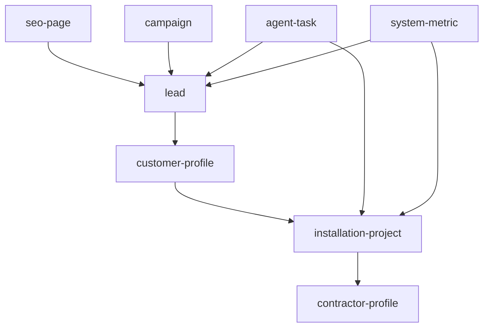

# SIRINX Solar Ops Entity Contract

Date: 2026-05-20
Source repo: `/Users/sirinx/restore-sources/github-audit/sirinx-solar-energy`
Target repo: `/Users/sirinx/sirinx-os`
Contract version: `2026-05-20.solar-ops-contract.v1`
Mode: local entity contract only
External writes: none
Secrets read or printed: none
Runtime changes: no Supabase, Cloudflare, CRM, public website, or customer portal mutation

## Purpose

Map the useful entities from `sirinx-solar-energy` into a SIRINX-owned operating contract before any database migration, Supabase write, portal exposure, or external CRM handoff.

This contract is deliberately non-mutating. It is a local planning boundary for Command Center, Hermes, Obsidian, and future Supabase/RLS design.

## Source Findings

| Source | Entity signals | Decision |
| --- | --- | --- |
| `database/schema.sql` | `leads`, `customers`, `installations`, `contractors`, `seo_pages`, `agent_tasks`, `campaigns`, `system_metrics` | Use as map only; do not apply SQL. |
| `sirinx-app/src/services/leads.ts` | lead CRUD with mock fallback | Keep concept; current public lead path remains D1/main-router. |
| `sirinx-app/src/services/customers.ts` | customer profile fields | Hold behind CRM/customer consent/auth review. |
| `sirinx-app/src/services/installations.ts` | project, savings, ROI, install status | Use for future install tracker after engineering evidence design. |
| `sirinx-app/src/services/contractors.ts` | contractor coverage and performance | Hold until contractor auth/storage/evidence policies exist. |
| `sirinx-app/src/services/campaigns.ts` | campaign spend, leads, conversions, ROI | Merge conceptually with marketing schema comparison. |
| `sirinx-app/src/services/metrics.ts` | KPI metrics | Use as local aggregate health concept only. |

## Canonical Entities

| Entity | SIRINX target | Status | Write gate |
| --- | --- | --- | --- |
| `lead` | `/api/lead-health`, `/api/lead-event-audit`, `lead-qualification.mjs` | implemented partial | Production POST, CRM, and Supabase writes require target approval. |
| `customer-profile` | future CRM/customer module | contract only | Requires consent, auth boundary, RLS, and CRM target approval. |
| `installation-project` | future project/install tracker | contract only | Requires engineering evidence, approved inverter model, and project owner approval. |
| `contractor-profile` | future contractor portal | contract only | Requires role auth, storage policy, onboarding approval, and evidence policy. |
| `seo-page` | protected public SEO/AEO backlog | contract only | Public website route/metadata task and SEO review required. |
| `campaign` | marketing/growth lane | contract only | Ad platform, CRM, ClickUp, Notion, or spreadsheet writes require exact target approval. |
| `agent-task` | Command Center backlog and 47 Ronin lanes | implemented partial | External PM writes require target approval. |
| `system-metric` | Command Center health cards | implemented partial | External analytics/database writes require schema approval. |

## Relationship Model



## Blocked Imports

| Import | Status | Reason |
| --- | --- | --- |
| Supabase service CRUD | blocked | Runtime target, credentials, RLS, and schema ownership are not approved. |
| `database/schema.sql` direct apply | blocked | Broad service-role policies and migration ownership need review. |
| Legacy mock PII | blocked | Mock phone/email/person names must not become SIRINX OS memory. |
| Cloudflare worker deploy sketches | blocked | Route ownership may overlap current public website. |

## Local API

```bash
GET /api/solar-ops-contract
pnpm solar-ops-contract:test
```

The endpoint reports:

- `externalWrites=false`
- `supabaseWrites=false`
- `cloudflareWrites=false`
- `customerVisible=false`
- `summary.migrationReady=false`

## Acceptance Gates

- No Supabase inserts, updates, deletes, migrations, or generated SQL from the old repo.
- No legacy mock PII copied into docs, memory, API responses, or tests.
- No Cloudflare worker deploy until route ownership and approval are complete.
- No customer or contractor portal exposure until auth, RLS, storage, and role boundaries are reviewed.
- Every future database field maps back to this SIRINX-owned entity contract before migration.

## Next Local Step

Use this contract as the schema boundary for future Supabase/RLS planning. If visibility is needed, add a read-only Command Center summary. Do not create migrations or external writes from this contract.
