# SIRINX VibeCoding System Wiring Rebuild

Date: 2026-05-26
Mode: local-only, approval-gated
Target repo: `/Users/sirinx/sirinx-os`

## Old Work Review

The current repo already contains the main local control-plane pieces:

- Governance files: `AGENTS.md`, `PROJECT_STATE.md`, `NEXT_ACTIONS.md`, `RULES_FOR_CODEX.md`.
- Command Center UI/API: `apps/dev-dashboard` and `services/dev-control-api`.
- Hermes inbox dry-run contract: `services/hermes-api`.
- Policy layer: `packages/policy-core`.
- Solar operator engine: `apps/solar-intelligence`.
- Public site local shell: `apps/sirinx-site`.
- Cloudflare router code: `infra/cloudflare/main-router`.
- External gate packets/evidence: `docs/approvals` and `docs/knowledge/external-gates`.
- AI Creator Radar and ClawForge local-only additions: `packages/content-factory`, `packages/clawforge-adapter`, `vault/research/x-ai-radar`.
- Full Local OS SOC/truth extension: `services/dev-control-api/src/soc-status.mjs`, `services/dev-control-api/src/truth-protocol.mjs`, `scripts/check-soc-monitor.mjs`, and `docs/knowledge/system-wiring/sirinx-full-local-os-lanes.md`.
- Local Vibe Coding Agent: `services/dev-control-api/src/vibe-coding-agent.mjs` converts Vibe workflow state, SOC status, truth protocol, and external gate evidence into safe local actions, blocked gates, human-review queue, and an approval packet.
- Unified Gateway Agent: `services/dev-control-api/src/gateway-agent.mjs` coordinates Codex, Hermes TUI, Gemini CLI, A2A2LoopSync, 47 Ronin lanes, Hermes Inbox dry-run, and knowledge split targets without auto-running external actions.
- AI Team Pairing: `services/dev-control-api/src/ai-team-pairing.mjs` pairs all 47 Ronin roles to the 12 active Hermes profiles, local runtime lanes, and A2A channels while Telegram/LINE remain blocked.

The old production website work is not treated as free-edit scope in this pass. `www.sirinx.co` remains protected, and the production website source mirror stays at `/Users/sirinx/restore-sources/ton36475-lgtm-sirinx`.

## System Wiring Contract

Machine-readable map:

```text
docs/knowledge/system-wiring/sirinx-vibecoding-system-map.json
```

Checker:

```bash
node scripts/check-system-wiring.mjs
pnpm wiring:check
```

The map defines every current lane with:

- local paths
- inputs
- outputs
- verification commands
- approval gates
- external-write blockers

## Main Flow

```mermaid
flowchart LR
  A["Human Goal"] --> B["Governance Files"]
  B --> C["Policy Core"]
  C --> D["Hermes Inbox Dry-Run"]
  D --> E["Dev Control API"]
  E --> F["Mission Control Dashboard"]
  F --> G["Local Vibe Coding Agent"]
  G --> H["Local Verification"]
  H --> I["Approval Packet"]
  I --> J["Stop Before External Action"]
```



## Lane Grid

| Lane | Current role | Verification | Approval boundary |
| --- | --- | --- | --- |
| Governance | Rules, project state, strict next actions | `pnpm project-os:check`, `pnpm verify` | Cannot override `AGENTS.md` |
| Policy Core | Allow/block/approval-required decisions | `pnpm policy-core:test` | No chat wording bypass |
| Hermes Inbox | Local normalized intent and approval queue | `pnpm hermes-inbox:test` | No external sends |
| Dev Control API | Local API surface for dashboard and gates | `pnpm verify` | External writes blocked |
| Mission Control Dashboard | Operator UI and visual audit surface | `pnpm dashboard:e2e` | Must stay private unless Access-approved |
| Local Vibe Coding Agent | Converts workflow/evidence state into safe local actions and approval packets | `pnpm vibe-agent:test`, `pnpm dashboard:e2e` | Cannot execute deploy/push/publish/connectors/MCP/messages/secrets |
| Solar Intelligence | Proposal, quotation, usage modeling | `pnpm solar:test`, `pnpm solar:check` | Final quote needs human review |
| Content Factory | AI Creator Radar and signal maps | `pnpm x-radar:check` | No scrape/copy/publish |
| ClawForge Adapter | Validate-only video plan | `pnpm clawforge:dry-run` | No real video/upload without approval |
| External Gates | Evidence and approval packets | `pnpm external-gates:evidence-check` | Exact gate phrase required |
| SOC Monitor | A2ASync-1CeoAgent read-only local host status | `pnpm soc:check`, `pnpm soc:test` | No Telegram send; no restart/delete/mutation |
| Truth Protocol | Separates observed/template/blocked/not_run claims | `pnpm soc:test`, `pnpm verify` | No unobserved real-world claims |
| Unified Gateway Agent | Coordinates local runtime lanes and A2A2LoopSync part assignments | `pnpm gateway-agent:test`, `pnpm wiring:check` | No CLI auto-run, per-profile gateway start, real MCP, connector write, or send |
| AI Team Pairing | Pairs all 47 roles to owner profiles, runtime lanes, and A2A channels | `pnpm ai-team-pairing:test`, `pnpm wiring:check` | No Telegram/LINE send, no per-profile gateway start, no connector activation |
| Model Fusion / AI Access / n8n | Blueprint lanes for future local OS orchestration | `pnpm wiring:check` | No paid API, connector activation, or workflow execution |
| Obsidian Brain | Summary-only memory and plan notes | local file check | No raw secrets/chat logs |

## Full Local OS Extension

Implementation report:

```text
docs/knowledge/SIRINX_FULL_LOCAL_OS_IMPLEMENTATION_2026-05-26.md
```

Mermaid architecture pack:

```text
vault/projects/sirinx-agent-native-os/SIRINXDEV_GRID_MERMAID_MASTER_ARCHITECTURE.md
```

The daily SOC/Telegram concept is now truth-gated. The dashboard can show local host metrics and a sanitized Telegram template state, but real Telegram delivery remains blocked until the `telegram-line-recipient-token` evidence file is complete and a final send approval phrase is provided.

## Known Blocker

`pnpm night-watch` has a repeated historical blocker: pnpm fetch/network failure before health checks start. Do not mark stack/Desktop/gateway/site/sitemap/province/git health as passing from that workflow unless the snapshot actually completes. Use the current successful verification scripts for local readiness, and keep night-watch as a separately reported blocker until fixed or approved for a fallback route.

## Rebuild Order

1. Keep the wiring map and checker passing.
2. Keep `verify:workspace`, `audit:secrets`, `check`, `demo`, `export:devpost`, `x-radar:check`, `clawforge:dry-run`, `soc:check`, `soc:test`, `vibe-agent:test`, `verify`, and root Vitest passing.
3. Wire new features into the local control plane first.
4. Add dashboard visibility only after API contracts are deterministic.
5. Create approval packets before any external activation.
6. Stop before deploy, push, publish, paid API, real MCP, external connector, production database write, or customer message.

## Stop Point

```text
VIBECODING SYSTEM WIRING READY — LOCAL ONLY — WAITING FOR HUMAN APPROVAL
```
