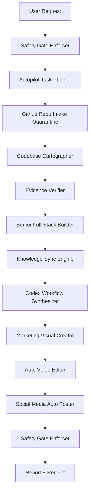

# GHOSTCLAW P101 SKILLS KIT INTEGRATION PROPOSAL

**Packet ID:** P101_SKILLS_INTEGRATION_20260715
**Date:** 2026-07-15
**Author:** GhostClaw Team
**Status:** DRAFT → PENDING APPROVAL → AUTHORIZED
**Runtime Mode:** local control plane (dry-run)

---

## Section 1: Goal & Scope

```yaml
goal: Integrate GhostClaw OS Skills Kit into sirinx-os ecosystem
scope:
  included:
    - Real-time WebSocket sync for Skills API
    - GitHub Actions auto-deploy workflows
    - Safety gate integration
    - Agent orchestration
  excluded:
    - Production deployment
    - Live provider calls
    - Secret access
    - Push to main branch
```

---

## Section 2: Evidence Packet

### Safety Evidence
- [x] Secret scan passed (no secrets)
- [x] MCP dry-run enabled
- [x] Environment variables safe

### Readiness Evidence
- [x] Skills API created (5 endpoints)
- [x] E2E spec documented
- [x] Package structure complete

### Implementation Evidence
```
/services/skills-api/
├── src/skills-router.mjs (ready)
├── src/server.mjs (ready)
└── package.json (ready)

/docs/
├── skills-kit-e2e-goal-spec.md
└── proposals/skills-integration-2026-07-15.md
```

---

## Section 3: Gate Structure

| Gate | Command | Status |
|------|---------|--------|
| Gate 1 | `/approve skills-websocket` | PENDING |
| Gate 2 | `/approve skills-deploy` | PENDING |
| Gate 3 | `/approve skills-integration-all` | PENDING |
| Gate 4 | `/gate-open P101` | BLOCKED |

---

## Section 4: Workflow Integration Map



---

## Section 5: Rollback & Recovery

```bash
# Rollback commands
git branch -D feature/skills-websocket
git branch -D feature/skills-deploy-actions
git reset --hard HEAD~[commits]

# Recovery steps
- Restart from ARCHITECTURE.md
- Re-run safety scan
- Rebuild skill definitions
```

---

## Section 6: Approval Matrix

| Action | Required Approval | From |
|--------|-------------------|------|
| WebSocket server | `/approve skills-websocket` | User/Operator |
| GitHub Actions | `/approve skills-deploy` | User/Operator |
| Full integration | `/approve skills-integration-all` | User/Operator |

---

## Section 7: Runtime Signature

**Signature:** `GHOSTCLAW_SKILLS_P101_PROPOSAL_20260715`

**Evidence Path:** 
- `/docs/proposals/skills-integration-2026-07-15.md`
- `/docs/proposals/proposal-scaffold-skills-integration.md`
- `/services/skills-api/src/`

**Policy:** local-only proposal, no real deploy, no provider calls

---

**End of Proposal Scaffold**

✅ **Ready for approval review**  
🛑 **No implementation until `/approve` command received**  
📝 **All evidence is proposal/scaffold stage only**