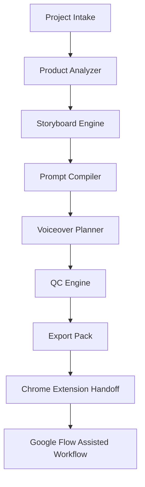
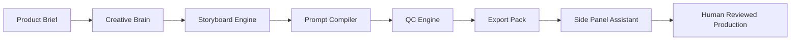

# AGM AUTOGLOW Research: Google Flow Automation Ecosystem

Status: LOCAL RESEARCH ARTIFACT  
Date: 2026-06-15  
Project: AGM AUTOGLOW / AutoFlow Engine  
Scope: Public-source research and system implications for a safe creative production workflow.

## Executive Summary

Google Flow has moved AI video production closer to a creative studio workflow: model capabilities include video generation with audio, image generation/editing, conversational multimodal editing, and production controls. Public extension listings around Google Flow show a clear market demand for prompt queues, batch workflows, script-to-video pipelines, reference image handling, and download organization.

The market signal is real, but the safest product position for AGM AUTOGLOW remains unchanged:

```text
AGM AUTOGLOW = AI Creative Production OS + assisted Flow side panel
AGM AUTOGLOW != hidden UI bot / credit bypass / private API replay / cookie tool
```

The strongest wedge is not faster clicking. It is better pre-production:

- product brief
- script
- storyboard
- visual continuity
- prompt pack
- voiceover script
- QC
- export pack
- human-reviewed side panel execution

## Evidence Classification

| Proof level | Meaning | How to use in AUTOGLOW |
|---|---|---|
| OFFICIAL | Google or Chrome official docs/pages | Can shape product requirements and safety rules |
| PUBLIC LISTING | Chrome Web Store or public product listing | Can shape market comparison, but avoid copying implementation |
| USER-PROVIDED | Notes/images/user market observations | Use as hypothesis until verified |
| INFERENCE | Architecture inferred from visible behavior | Use as design input, not as a fact claim |

## Official Platform Facts

| Area | Verified public signal | AUTOGLOW implication | Source |
|---|---|---|---|
| Google Flow model stack | Google Flow publicly lists Gemini Omni, Nano Banana, and Veo 3.1 as creative tools/models. | AUTOGLOW should compile prompts and storyboards for Flow-compatible workflows without claiming internal integration. | https://labs.google/fx/tools/flow |
| Nano Banana / Imagen models | Google Flow Help lists Nano Banana 2, Nano Banana Pro, and Imagen 4 as supported image model options. | The prompt compiler should support image-first and video-first scene packs. | https://support.google.com/flow/answer/16352836 |
| Veo video and audio direction | Google and DeepMind describe Veo 3.1 as video generation with audio and improved creative control/prompt adherence. | AUTOGLOW should include voiceover/native-audio planning fields and motion direction fields. | https://blog.google/innovation-and-ai/products/veo-updates-flow/ and https://deepmind.google/models/veo/ |
| Chrome side panel | Chrome states the Side Panel API hosts extension UI alongside the main content, requires `sidePanel`, and supports persistent companion UX. | The current side panel architecture is the correct safe surface for Flow-adjacent assistance. | https://developer.chrome.com/docs/extensions/reference/api/sidePanel |
| Chrome permissions | Chrome docs say extension APIs require manifest permissions and some trigger warnings. | Keep permissions minimal and test for no `debugger`, `cookies`, broad tabs, or broad host permissions. | https://developer.chrome.com/docs/extensions/reference/permissions-list |
| Chrome storage | Chrome storage API is designed for extension-specific persistence across extension contexts. | Use `chrome.storage.local` for local project/queue state, not page `localStorage` or account/session data. | https://developer.chrome.com/docs/extensions/reference/api/storage |
| Chrome user data policy | Chrome Web Store Limited Use policy requires disclosed, limited use of user data. | If cloud sync/licensing is added later, publish privacy copy before store release. | https://developer.chrome.com/docs/webstore/program-policies/limited-use |

## Public Extension Market Scan

This table captures public listing-level signals only. It does not imply endorsement, compatibility, or implementation knowledge.

| Product / listing | Publicly stated capability | Category signal | AUTOGLOW response |
|---|---|---|---|
| Google Flow Automator | Public listing describes prompt queue automation and keeping generation tasks moving in sequence. | Prompt queue and repetitive workflow reduction are demanded by users. | Build safer queue assistant first: copy, status, export, human action. |
| Auto Flow Factory | Public listing describes script-to-video pipeline, batch generation, reference images, scene consistency, script splitting, and styles. | Users want upstream script and storyboard intelligence, not just prompt sending. | Prioritize storyboard engine, character/reference map, and prompt compiler. |
| Auto Flow Pro / Flow Automation store | Public marketing describes model preferences, image-to-video, reference images, and batch workflows. | Market is moving toward production packs and configurable model workflows. | Add project templates and export packs before deeper automation. |
| VEO Automation user guide repo | Public repo description focuses on batch video/image generation on Google Flow. | Batch automation is a common category frame. | Avoid private replay; keep assisted local workflow and audit trail. |
| Thai tools mentioned by user, including Flow บ้านเฮีย / AGM AUTOFLOW | User-provided competitive context. Not independently verified in this pass. | Treat as local market hypothesis. | Differentiate on safety, client delivery packs, Thai creator workflows, and permission-minimal design. |

## ตารางเปรียบเทียบคุณลักษณะเชิงสถาปัตยกรรม

กรอบนี้เป็นวิศวกรรมย้อนรอยเชิงฟีเจอร์และเชิงระบบเท่านั้น ไม่รวมการดึง token, cookie, private API, quota bypass หรือวิธีเลี่ยงระบบใด ๆ

| กลุ่มระบบ / เครื่องมือ | บทบาทในระบบนิเวศ | ฟังก์ชันหลักที่ตรวจพบหรืออนุมานได้ | รูปแบบ Automation | จุดแข็งเชิงผลิตภาพ | ความเสี่ยงเชิงเทคนิคและนโยบาย | บทเรียนสำหรับ AGM AUTOGLOW |
|---|---|---|---|---|---|---|
| Google Flow Core Platform | แพลตฟอร์มหลักสำหรับการสร้างวิดีโอ ภาพ และเวิร์กโฟลว์สื่อสร้างสรรค์ | สร้างและแก้ไขวิดีโอ/ภาพ, ใช้โมเดล Gemini Omni, Nano Banana และ Veo 3.1, มี creative tool surface สำหรับงานวิดีโอและภาพ | Native creative studio / agent-assisted workflow | ควบคุมงานสร้างสรรค์ได้ลึกกว่า single-clip generator และเริ่มเข้าใกล้ production environment | จำกัดตาม region, subscription tier, policy และ quota ของบัญชีผู้ใช้ | AGM AUTOGLOW ไม่ควรแทนที่ Flow แต่ควรทำหน้าที่เป็น production layer ที่เตรียม brief, storyboard, prompt, voiceover และ export pack ก่อนส่งต่อ |
| Google Flow Automator | ส่วนขยายช่วยลดงานซ้ำใน Google Flow | Queue prompts, prompt sequencing และงานซ้ำเชิงคิวตาม public listing | Browser extension automation ภายในหน้า Flow | ลดเวลาป้อน prompt ทีละรายการ เหมาะกับงาน batch และ creator ที่ต้องผลิตจำนวนมาก | ผูกกับ DOM/UI ของเว็บ หาก Google เปลี่ยน interface มีโอกาสพัง; ต้องระวัง privacy/login data | AGM ควรแยก core engine ออกจาก Flow adapter เพื่อให้เปลี่ยน adapter ได้เมื่อ UI เปลี่ยน |
| Auto Flow Factory / Auto Flow Pro class | เครื่องมือเชิงพาณิชย์สำหรับ bulk generation บน Google Flow | Script-to-video pipeline, batch generation, reference image/character handling, style slots, monitoring, pause/resume/stop/skip ตาม public listing/marketing | Parallel หรือ semi-parallel prompt runner พร้อม dashboard | ตอบโจทย์ตลาด high-volume generation และ agency workflow | Third-party ไม่เกี่ยวข้องกับ Google; อาจได้รับผลกระทบเมื่อ Flow เปลี่ยน UI; claim เรื่องจำนวนงานต่อวันต้องสื่อสารอย่างระมัดระวัง | AGM ควรแข่งขันด้วย workflow intelligence ไม่ใช่แค่จำนวน prompt ต่อรอบ |
| Batch Prompt Queue Extensions | เครื่องมือทั่วไปสำหรับ queue prompt บนแพลตฟอร์ม AI หลายชนิด | Paste/import prompts, run queue, retry failed jobs, save output | Cross-platform prompt automation | โครงสร้าง queue ใช้ซ้ำได้กับหลายแพลตฟอร์ม | หากขอ permission กว้างเกินไป เสี่ยง privacy/security และ store rejection | AGM ควรออกแบบ queue engine เป็น platform-agnostic แล้วทำ adapter แยกสำหรับ Flow, Gemini, AI Studio หรือเครื่องมืออื่น |
| Thai Community Tools เช่น Flow บ้านเฮีย / AGM AUTOFLOW | เครื่องมือหรือ workflow จากกลุ่มผู้ใช้งานไทยที่แก้ปัญหางานจริง | มักเน้น prompt pack, storyboard, reference, batch generation, template, training และ community support | Tool + knowledge product + service bundle | เข้าใจ pain point ผู้ใช้ไทย เช่น คลิปขายของ, affiliate, TikTok, Reels, Shopee, งานเสียงพากย์ไทย | ข้อมูลบางส่วนอาจอยู่ในกลุ่มปิดหรือไม่สามารถตรวจสอบจากแหล่งสาธารณะได้ครบ | AGM AUTOGLOW ควรวางตัวเป็นระบบ local-first ที่มีเอกสาร, schema, safety gate และ dashboard ชัดเจน เพื่อยกระดับจาก “เครื่องมือกลุ่ม” เป็น product จริง |
| AGM AUTOGLOW Proposed Architecture | Creative Production OS สำหรับเตรียมงานก่อนส่งเข้า Flow / Veo / เครื่องมือวิดีโอ AI | Project Intake, Product Analyzer, Storyboard Engine, Prompt Compiler, Voiceover Script/TTS, Export Pack, Extension Handoff, API Wiring Dashboard | Local-first dashboard + assisted Chrome side panel + safe adapter layer | แก้ปัญหาต้นน้ำของ production: brief ไม่ชัด, prompt ไม่เป็นระบบ, scene ไม่ต่อเนื่อง, export ไม่ครบ, ส่งงานลูกค้ายาก | หากขยายเป็น automation จริงต้องรักษาเส้นแบ่ง policy: ไม่ดึง token, ไม่ bypass quota, ไม่ใช้ private API, ไม่ทำ hidden automation | เส้นทางชนะคือสร้างระบบคิดและระบบส่งมอบงาน ไม่ใช่แข่งเป็น bot คลิกเร็วที่สุด |

## ข้อค้นพบเชิงวิศวกรรมย้อนรอยระดับระบบ

จากการเปรียบเทียบเครื่องมือในตลาด extension automation สำหรับ Google Flow มักประกอบด้วย 7 ชั้นหลัก:

1. Input Layer  
   รับ prompt, CSV, JSON, TXT, รูป reference, character reference และ metadata ของโปรเจกต์

2. Queue Layer  
   จัดลำดับ prompt, ตั้งสถานะงาน, retry, pause/resume, skip และ batch control

3. Page Adapter Layer  
   ตรวจสถานะหน้าเว็บ เปลี่ยน state ตามสิ่งที่ผู้ใช้เห็น เช่น ready, generating, completed, failed หรือ rate-limited

4. Generation Control Layer  
   ส่ง prompt หรือช่วยผู้ใช้ส่ง prompt ตามคิว โดยระบบที่ปลอดภัยควรมี human approval gate และไม่ทำงานซ่อนแบบไม่มี consent

5. Asset Management Layer  
   จัดการภาพอ้างอิง ตัวละคร ไฟล์ output ชื่อไฟล์ และ folder structure

6. Export Layer  
   ส่งออกเป็น `project.json`, `storyboard.md`, `prompts.csv`, `voiceover.txt`, `captions.txt` และ `extension-handoff.json`

7. Monitoring / Dashboard Layer  
   แสดงจำนวน scene, job status, error, retry, export pack, local sync และ API wiring

## ข้อเสนอเชิงสถาปัตยกรรมสำหรับ AGM AUTOGLOW

AGM AUTOGLOW ควรถูกออกแบบเป็นระบบ 2 แกน:

1. Creative Brain  
   ทำหน้าที่คิดงานก่อนเข้าระบบสร้างวิดีโอ ได้แก่ product analysis, script generation, storyboard planning, prompt compilation, voiceover planning และ QC checklist

2. Safe Flow Assistant  
   ทำหน้าที่ช่วยผู้ใช้ทำงานบน Google Flow แบบ manual-assisted ได้แก่ side panel, prompt queue, copy prompt, mark scene status, local handoff และ export pack โดยหลีกเลี่ยงการแตะ token, cookie, session หรือ private endpoint

สถาปัตยกรรมที่เหมาะสม:



## หลักการออกแบบระบบให้สอดคล้องกับการทำงานจริง

1. Local-first by default  
   ข้อมูลโปรเจกต์, storyboard, prompt และ export pack ควรทำงานในเครื่องก่อน เพื่อป้องกันการรั่วไหลของข้อมูลลูกค้าและลด dependency ต่อ provider ภายนอก

2. Human-in-the-loop  
   ทุกขั้นตอนที่ส่งผลต่อการสร้างวิดีโอจริงควรมีผู้ใช้ยืนยัน โดยเฉพาะการส่ง prompt เข้าแพลตฟอร์มปลายทาง

3. Adapter-based architecture  
   ห้ามผูก core engine กับ DOM ของ Google Flow โดยตรง Core engine ต้องแยกจาก Flow adapter เพื่อให้เปลี่ยน adapter ได้เมื่อ UI เปลี่ยน

4. No private API replay  
   หลีกเลี่ยงการจับ request จาก DevTools แล้วนำมา replay เพราะเสี่ยงต่อข้อกำหนดแพลตฟอร์ม ความปลอดภัย และความน่าเชื่อถือของสินค้า

5. Quota-aware workflow  
   ระบบควรช่วยผู้ใช้ประเมินจำนวน scene, prompt, export และรอบการ retry เพื่อไม่ให้เผาเครดิตโดยไม่จำเป็น

6. Prompt-to-delivery pipeline  
   จุดขายของ AGM AUTOGLOW ไม่ควรเป็น “กดแทนคน” แต่ควรเป็น “ผลิตชุดงานพร้อมส่งลูกค้า” ตั้งแต่ brief, storyboard, prompt, voiceover, caption และ delivery files

## Dashboard Architecture Signal

ภาพ mock dashboard ที่แนบมากับงานนี้ให้ทิศทาง UI/UX ที่เหมาะกับ Web Dashboard MVP:

- Command-center navigation: Dashboard, Projects, Project Intake, Storyboard, Prompt Engine, Voiceover, Export Pack, Extension Handoff, API Wiring, Settings
- Top-level operational metrics: total projects, active scenes, export packs, queue status, local sync
- Project summary panel: brand, product, audience, objective, platform, duration, aspect ratio, tone, visual style
- Storyboard cards: per-scene state, thumbnail slot, prompt path, voiceover file, caption, QC status
- API wiring / workflow map: Intake API -> Storyboard Engine -> Prompt Compiler -> Voiceover Service -> QC Engine -> Export Service -> Extension Handoff
- Extension handoff panel: target tool, mode, local readiness, and no external action by default
- Export pack panel: generated local files and download bundle

This dashboard should be implemented as a local-first operational interface, not a marketing landing page.

## Reverse-Engineered Pattern

Public tools and user-provided screenshots imply a repeated workflow:


The risky implementation path is browser automation that directly manipulates Flow as a hidden robot. The durable implementation path is:



## Research-Derived AUTOGLOW Requirements

### P0 Requirements

- Keep Manifest V3.
- Keep side panel as the primary browser UI.
- Keep permission set minimal: `storage`, `sidePanel`, `activeTab`.
- Keep host permission constrained to `https://labs.google/*`.
- Store only user-authored project data and queue state.
- Provide manual copy and mark-done flow.
- Generate delivery packs that work without browser automation.

### P1 Requirements

- Add Character Bible.
- Add Reference Map.
- Add per-scene continuity constraints.
- Add voiceover and native-audio intent fields.
- Add platform presets for TikTok, Reels, YouTube Shorts, Shopee Video, and Facebook Reels.
- Add prompt quality score and human QC checklist.

### P2 Requirements

- Add optional local dashboard.
- Add import/export between dashboard and extension.
- Add template marketplace only after privacy and licensing rules are written.
- Add provider/API hooks only behind explicit approval gates.

## Safety Rules For Future Automation

Allowed future automation:

- Copy prompt to clipboard on user click.
- Save local queue status.
- Warn when a scene needs review.
- Organize exported file names.
- Generate Markdown/CSV/JSON production packs.

Blocked future automation:

- `debugger` permission for normal users.
- `cookies` permission.
- Broad `tabs` permission unless a specific audited feature requires it.
- Reading Google account identifiers.
- Reading or storing page auth data.
- Private API replay.
- Captcha, rate-limit, quota, or credit bypass.
- Hidden auto-clicking.
- Auto-posting, auto-commenting, or publishing.

## Product Differentiation

AGM AUTOGLOW should sell:

- Thai-first content planning.
- High-quality prompts for visual continuity.
- Client-ready delivery packs.
- Local creator and SME workflows.
- Permission-minimal extension trust.
- Human-reviewed production.

AGM AUTOGLOW should not sell:

- "Unlimited Flow credits".
- "No ban".
- "Zero cost generation" unless the provider explicitly supports it.
- "Fully automatic posting/commenting".
- "Private API access".

## Implementation Impact

Current MVP already matches the research:

- `packages/autoglow-core` covers schema, validation, prompt compilation, and exports.
- `apps/agm-autoglow-extension` uses Manifest V3 side panel.
- Manifest tests block `debugger`, `cookies`, and `tabs`.
- Side panel is assisted-only and local.

Next best implementation gate:

```text
APPROVE_AGM_AUTOGLOW_WEB_DASHBOARD_MVP_LOCAL_ONLY
```

Scope:

- Project Intake UI.
- Storyboard Cards.
- Prompt Pack preview.
- Markdown/CSV export.
- Extension handoff by JSON copy/import.

Blocked:

- provider calls
- deploy
- push
- live Telegram
- Google Flow auto-clicking
- private API replay
- external publish

## Research Footnotes

| ID | Evidence | Source |
|---|---|---|
| S1 | Google Flow publicly presents Flow as a creative studio surface for video/image/custom tools and lists Gemini Omni, Nano Banana, and Veo 3.1. | https://labs.google/fx/tools/flow |
| S2 | Google Flow Help lists Nano Banana 2, Nano Banana Pro, and Imagen 4 as supported image model options. | https://support.google.com/flow/answer/16352836 |
| S3 | Google Flow Automator public listing describes prompt queue automation and sequence handling. | https://chromewebstore.google.com/detail/google-flow-automator/jincmbkbdocdfgljlmoididhodhenbgm |
| S4 | Auto Flow Factory public listing describes script-to-video, batch generation, reference images, and consistency-oriented workflow features. | https://chromewebstore.google.com/detail/auto-flow-factory/jlcnpiafmbhjakjmidppodpcdodgklni |
| S5 | Chrome Side Panel API supports persistent companion UI in the browser side panel and requires the `sidePanel` permission. | https://developer.chrome.com/docs/extensions/reference/api/sidePanel |
| S6 | Chrome permissions and Limited Use policy support the permission-minimal/privacy-first design decision. | https://developer.chrome.com/docs/extensions/reference/permissions-list and https://developer.chrome.com/docs/webstore/program-policies/limited-use |
| S7 | VideoDirectorGPT supports LLM-guided multi-scene video planning with scene descriptions, entities, layouts, backgrounds, and consistency groupings. | https://arxiv.org/abs/2309.15091 |
| S8 | Video Storyboarding focuses on multi-shot character consistency for text-to-video generation. | https://research.nvidia.com/labs/par/video_storyboarding/ |
| S9 | DreamShot investigates personalized storyboard synthesis and long-video creation from storyboard-like shots. | https://arxiv.org/html/2604.17195v1 |
| S10 | VAST 1.0 frames video generation as storyboard-based controllable and consistent generation. | https://arxiv.org/html/2412.16677v1 |
