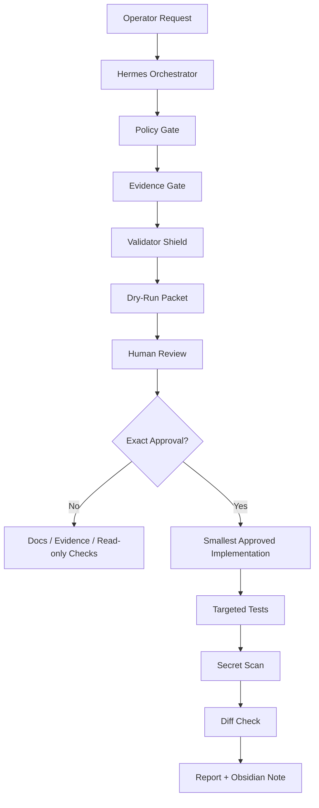

# Hermes Sovereign Orchestrator Research Execution Packet

Generated: 2026-05-28 02:22 +0700
Mode: local-only, research-grade, no source implementation, no external mutation

## Research Objective

Turn the current SIRINX/Hermes workspace into an evidence-driven agent operating system without bypassing approval gates.

This packet defines the next automatic work sequence that can run safely before source-code implementation approval.
It is intentionally written as a research execution protocol: hypotheses, evidence, risk controls, evaluation criteria,
and stop conditions are explicit.

## Current Constraint

The project gate still requires exact source implementation approval:

```text
APPROVE_IMPLEMENTATION
```

Until that exact phrase is present for a named target, automated work is limited to:

- Inspect local files and app state.
- Update planning docs.
- Update `.hermes/context.md` and `.hermes/state.json`.
- Create dry-run plans and evidence.
- Run read-only health/status checks.

Blocked:

- Source-code implementation.
- Package installation.
- MCP server start/reload.
- External connector activation.
- Paid provider call.
- Secret read/print.
- Message send.
- Deploy, push, publish.
- Automatic Kanban dispatch or live agent auto-start.

## Research Premises

| Premise | Evidence |
| --- | --- |
| Hermes TUI is the primary orchestrator | Project context and Hermes-native planning skill |
| n8n should be treated as high-risk until scoped | Official n8n MCP access can search, interact with, trigger/test, create/edit workflows and data tables |
| MCP tool metadata is not enough for trust | MCP spec says annotations must be treated as untrusted unless from trusted servers |
| n8n-mcp can be useful as a documentation bridge | n8n-mcp README describes node documentation, properties, operations, examples, and templates |
| Production workflow edits by AI must be blocked | n8n-mcp README explicitly warns not to edit production workflows directly with AI |

## Research-Grade Execution Model



## Work Packages

### WP-0: State Baseline

Purpose: keep a single source of truth for current continuation status.

Artifacts:

- `.hermes/reports/SIRINX_CONTINUATION_BACKLOG_2026-05-28.md`
- `.hermes/context.md`
- `.hermes/state.json`
- Obsidian continuation board

Status: complete for this phase.

### WP-1: n8n MCP Read-Only Policy

Purpose: define a safe boundary before any MCP registration.

Artifacts:

- `.hermes/reports/N8N_CAPABILITY_MANIFEST_2026-05-28.md`
- `docs/integrations/N8N_MCP_PERMISSION_POLICY.md`
- `.hermes/reports/N8N_MCP_PERMISSION_POLICY_STATUS.md`

Status: draft complete, not activated.

### WP-2: n8n MCP Evaluation Protocol

Purpose: define how to evaluate future read-only n8n MCP usage before live registration.

Output artifact:

- `docs/research/N8N_MCP_EVALUATION_PROTOCOL.md`

Required properties:

- All test questions must be read-only.
- No question may require workflow data, credentials, execution history, or API keys.
- Every expected answer must be stable and verifiable from public/static docs or locally captured manifests.

### WP-3: External Gate Evidence Protocol

Purpose: standardize how to fill evidence files without secrets.

Output artifact:

- `docs/knowledge/external-gates/EVIDENCE_COLLECTION_PROTOCOL.md`

Required properties:

- Non-secret evidence only.
- One gate at a time.
- No checkboxes marked unless the operator has confirmed the fact.
- Re-run `pnpm external-gates:evidence-check` after every evidence update.

### WP-4: Implementation Approval Packet

Purpose: prepare exact implementation choices without making source changes.

Candidate targets:

1. `APPROVE_IMPLEMENTATION for n8n permission policy display`
2. `APPROVE_IMPLEMENTATION for external gate dashboard evidence viewer`
3. `APPROVE_IMPLEMENTATION for Phase 0 security audit dashboard panel`

Each approval target must include:

- Files allowed to change.
- API route or dashboard section name.
- Test command.
- Stop condition.

## Evaluation Metrics

| Metric | Passing condition |
| --- | --- |
| Secret safety | `pnpm audit:secrets` has no findings |
| Format safety | `git diff --check` passes |
| Gate safety | `pnpm external-gates:evidence-check` reports 0 executable gates until evidence is complete |
| JSON safety | `.hermes/state.json` parses |
| Scope safety | No source implementation without exact `APPROVE_IMPLEMENTATION` |
| MCP safety | n8n-mcp remains unregistered until exact approval |
| External safety | No deploy/push/publish/send/provider/API mutation |

## Immediate Automatic Sequence

The safe automated sequence is:

1. Create n8n MCP evaluation protocol.
2. Create external gate evidence protocol.
3. Update continuation backlog and Obsidian digest.
4. Run JSON/diff/secret/external-gate verification.
5. Stop with an approval packet for the first implementation target.

## Stop Point

Stop before source implementation. The next source/API/dashboard step requires:

```text
APPROVE_IMPLEMENTATION for n8n permission policy display
```

