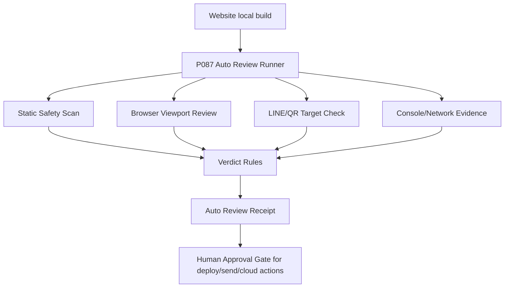

# P087 Computer-Use Auto Review Gate

Status: local-safe implementation
Scope: `apps/sirinx-site`
Mode: auto-review for low-risk checks, human approval for high-risk actions

## Purpose

P087 reduces waiting on manual review by letting local browser automation inspect the SIRINX website like a careful reviewer. It captures evidence, validates routes, checks mobile layout, confirms LINE/QR targets without sending messages, and writes local receipts.

This gate does not approve production deploys, Cloudflare mutation, LINE webhook activation, CRM/customer data storage, customer messaging, provider calls, or secret access.

## Architecture



## Command

```bash
pnpm --filter @sirinx/site auto-review:website
```

Output is written under:

```text
reports/review/p087/
```

## Verdicts

- `auto_review_pass`: all low-risk checks pass and no high-risk action is requested.
- `auto_review_pass_needs_human_approval`: review passes, but the next action is deploy, push, cloud mutation, webhook activation, CRM storage, or live messaging.
- `review_blocked_with_findings`: blocked pattern, failed check, or high/critical finding exists.

## Human Approval Boundary

Computer-use auto review may replace low-risk human inspection, but it must not replace explicit approval for:

- production or preview deploy
- Cloudflare/R2/D1/KV/DNS mutation
- LINE webhook activation
- Telegram/LINE/email/customer live send
- CRM/customer data storage
- secret read/print
- paid provider/model calls

