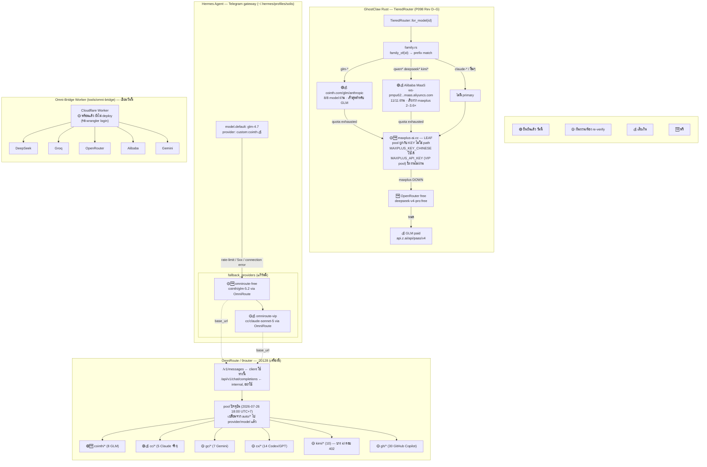
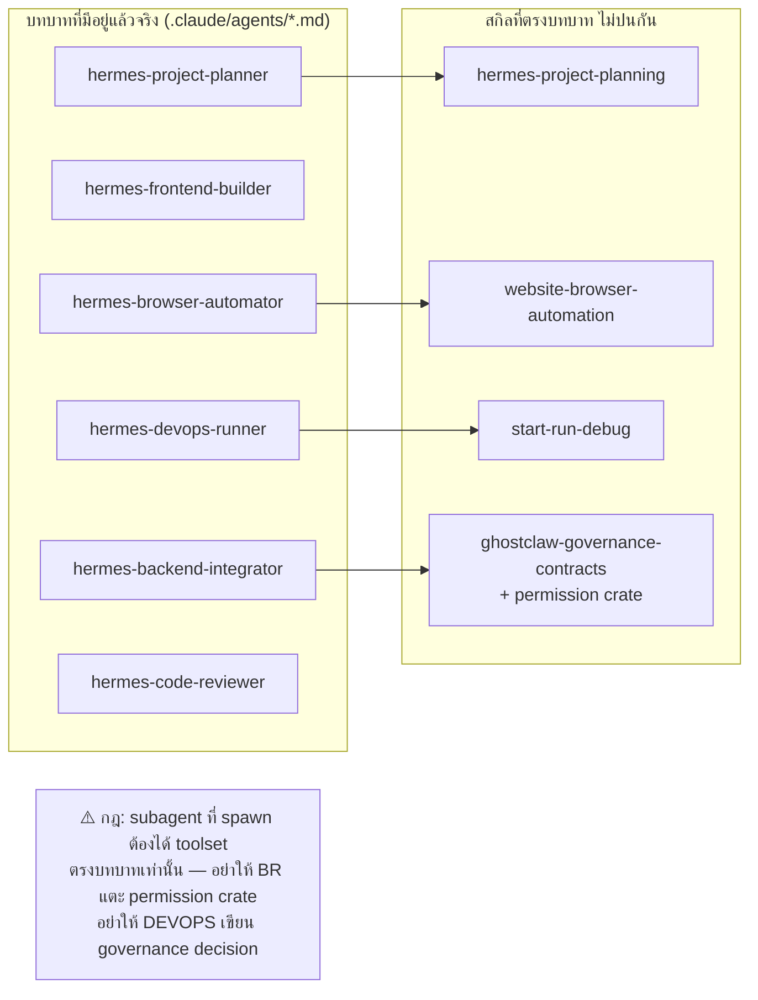

# Model routing architecture — the persistent reference

**เขียนไว้เพื่อไม่ต้องทวนซ้ำ** ทุกอย่างในนี้ verify จากของจริงในเครื่องวันที่ 2026-07-25/26
ถ้าอ่านตอนหลังแล้วของไม่ตรง ให้เชื่อของจริงมากกว่าเอกสารนี้เสมอ — โดยเฉพาะ §4

---

## 1. ภาพรวม — สองระบบ ไม่ใช่หนึ่งเดียว



---

## 2. กฎการแยกเสียเงิน / ฟรี — ป้องกันเลือกผิด

**หลักการเดียว: primary lane ที่ผ่านการวัด latency แล้วคือของที่ "ควรใช้" — ไม่ใช่ของที่ "ฟรีที่สุด"**
maxplus เป็น LEAF (สำรอง) ไม่ใช่เพราะมันฟรี แต่เพราะมันช้ากว่าทุกตัวที่วัดมา (P098 Rev G §3)

| Lane | เงิน | ยืนยันแล้ว | ใช้เมื่อไหร่ |
|---|---|---|---|
| `cointh` | 💰 จ่ายตาม token | 🟢 8/8 | primary ของ GLM ทุกรุ่น |
| `alibaba` (MaaS) | 💰 70M token ฟรีตั้งต้น แล้วจ่าย | 🟢 11/11 | primary ของ qwen/deepseek/kimi |
| `maxplus` | 🆓/💰 แล้วแต่ pool ที่คีย์ผูกอยู่ | 🟡 10/13 (คีย์ Chinese) | LEAF เท่านั้น — ไม่ใช่ default |
| `openrouter-free` | 🆓 | ไม่ได้ probe ซ้ำวันนี้ | ปลายทางสุดท้ายก่อน paid |
| `glm-paid` (api.z.ai) | 💰 | ไม่ได้ probe ซ้ำวันนี้ | ปลายทางสุดท้ายจริงๆ |
| OmniRoute `cc/*` | 💰 (Claude จริง) | 🟢 ทดสอบสด `cc/claude-sonnet-5` | ต้องรู้ตัวว่ากำลังเรียก Claude ผ่าน reseller |
| OmniRoute `cointh/*` | 💰 (ผ่าน OmniRoute) | 🟢 `cointh/glm-5.2` | ซ้ำกับ lane `cointh` ตรง — ใช้ lane ตรงเร็วกว่า |
| OmniRoute `kimi/*` | 💰 | 🟡 `kimi/kimi-k3` → **402 payment required** | อย่า route ไปโดยไม่เช็ค |

**กันพลาดที่ระดับโค้ด:**
- `ProviderError::Exhausted` แยกจาก `Unavailable` ชัดเจนในฝั่ง Rust — โควตาหมด ≠ error ทั่วไป ป้องกันไม่ให้ fault ชั่วคราวถูกตีความเป็น "หมดเงินแล้วให้ไปทางฟรี"
- `signals_exhaustion()` เช็คทั้ง status code และ body message เพราะ evidence จริงจากเครื่องนี้ (2026-06-30) แสดงว่าโควตาหมดมาเป็น **HTTP 401** ไม่ใช่ 402/429 เสมอไป — เดาผิดจุดนี้เคยเกือบทำให้ fallback ไม่ทำงานเลย

---

## 3. Skill / Tool ที่ agent เรียกใช้ได้ — สถานะจริงวันนี้

```
~/.hermes/skills           179 skills (built-in)
~/.agents/skills            10 skills (external_dirs — shared กับ opencode/codex/zcode)
~/.gemini/skills             9 skills (external_dirs)
รวมไม่ซ้ำ: 204 · ชนกันจริง: 6 ชื่อ (create-voltagent, hermes-godmode-team-ops,
                                    sirinx-spec-first-swarm, voltagent-best-practices,
                                    voltagent-core-reference, voltagent-docs-bundle)
```

192 warning ที่เจอใน `agent.log` วันนี้ = การชนกัน 6 ชื่อนี้ถูก log ซ้ำหลายรอบสแกน ไม่ใช่ 192 ปัญหาต่างกัน

**ที่ยังไม่แก้ (เพราะยังไม่ approve):** เลือก canonical source ให้ 6 ชื่อที่ชน — เหลือ 198 ตัวไม่ต้องแตะ

---

## 4. ⚠️ สิ่งที่ผันผวนจริง — ต้อง re-verify ก่อนใช้เสมอ

**OmniRoute เปลี่ยนโครงชื่อ model กลางวันนี้เอง** ไม่ใช่ผมทำพลาด:

| เวลา (โดยประมาณ) | จำนวน model | รูปแบบชื่อ |
|---|---|---|
| รอบเช้า | 99 | `auto/best-coding`, `oc/deepseek-v4-flash-free` |
| กลางวัน (ระหว่าง ZCode ทำงาน) | 391 | เหมือนเดิมแต่เพิ่ม provider ใหม่ |
| เย็น (ตอนเขียนเอกสารนี้) | **74** | `cointh/glm-5.2`, `cc/claude-sonnet-5`, `gh/copilot-search-a` — **`auto/*` หายไปหมด** |

**บทเรียน:** ห้าม hard-code model id ของ OmniRoute ไว้ถาวรที่ไหนโดยไม่มีแผน re-verify
ที่แก้ไปใน Hermes config (`cointh/glm-5.2`, `cc/claude-sonnet-5`) คือค่าที่ **ยืนยันสดตอนเขียนเอกสารนี้เท่านั้น** — ถ้ากลับมาอ่านทีหลังแล้วมัน 404 ให้ยิง `GET /api/v1/models` ใหม่ก่อนสงสัยอย่างอื่น

**Endpoint ที่ถูกต้องของ OmniRoute:**
```
✅ POST /v1/messages              ← client ใช้ทางนี้ (Anthropic-style)
❌ POST /api/v1/chat/completions  ← internal dashboard API, ตอบ 503 ให้ model ที่ใช้ได้จริงด้วยซ้ำ
```
บั๊กนี้ทำให้ผมรายงานผิดไปหลายรอบก่อนหน้าว่า "OmniRoute ใช้ไม่ได้ 78%" — ที่จริงยิงผิด endpoint

---

## 5. งานวันนี้ที่ทำเสร็จแล้ว (อย่าทำซ้ำ)

| # | งาน | ไฟล์ | สถานะ |
|---|---|---|---|
| P098 Rev D–G | maxplus/cointh/alibaba lane + per-family routing | `ghostclaw-os/crates/providers/` | 🟢 102 tests |
| P100 | ลบ RED auto-approve, CI guard | `ghostclaw-os/crates/core/` | 🟢 |
| Permission crate | HumanPrincipal ไม่มี constructor สาธารณะ | `ghostclaw-os/crates/permission/` | 🟢 35 tests |
| Omni-Bridge Worker | แก้บั๊ก 6 จุดจากดราฟต์ที่ส่งมา | `tools/omni-bridge/` | 🟡 พร้อม รอ deploy |
| Hermes fallback wiring | omniroute-free → omniroute-vip | `~/.hermes/profiles/solis/config.yaml` | 🟢 เขียนวันนี้ backup ไว้แล้ว |
| Skill collision diagnosis | 6 ชื่อชนกันจริง (ไม่ใช่ 192 ปัญหา) | — | 🟡 diagnose แล้ว ยังไม่แก้ |
| OmniRoute native binary | lightningcss ดาวน์โหลดไม่ครบ 3.9MB→8.1MB | `integrations/omniroute/node_modules/` | 🟢 |

---

## 6. Agent / Sub-agent ↔ ทักษะที่ควรได้รับมอบหมาย



**กฎที่มีอยู่แล้วจาก CLAUDE.md:** วางแผนก่อน implement เสมอ แบ่งงานตาม file ownership ไม่ให้ agent สองตัวแก้ไฟล์เดียวกันพร้อมกัน (บทเรียนจากการชนกับ ZCode วันนี้ — ต้องเช็ค process ยังทำงานอยู่ไหมก่อนแตะไฟล์ที่มันถืออยู่)

---

## LABELS

VERIFIED (ยิงจริงวันนี้): cointh 8/8, alibaba 11/11, maxplus 10/13, OmniRoute `cointh/glm-5.2`+`cc/claude-sonnet-5` ผ่าน `/v1/messages`, skill collision 6 ชื่อ, Hermes config patch 3 จุด + fallback chain
UNVERIFIED: openrouter-free/glm-paid ไม่ได้ probe ซ้ำวันนี้, OmniRoute `gc/*`/`cx/*`/`gh/*` ยังไม่ทดสอบยิงจริง, model list ของ OmniRoute จะเปลี่ยนอีกเมื่อไหร่ไม่ทราบ
