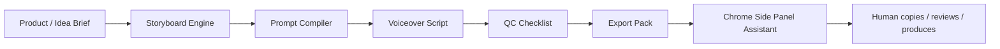

# AGM AUTOGLOW v0.2 Design

Status: LOCKED FOR LOCAL MVP  
Date: 2026-06-15  
Sales name: AGM AUTOGLOW  
Internal system: AutoFlow Engine

## Product Position

AGM AUTOGLOW is an AI Creative Production OS for turning a product or idea into a script, storyboard, prompt pack, voiceover script, and delivery files for Google Flow, Veo, Reels, TikTok, Shopee Video, and related production workflows.

It is not a hidden Google Flow click bot. It is a workflow assistant that helps creators think, plan, queue, review, and export content.

## Hard Boundaries

Allowed:

- Build product and campaign briefs.
- Build scene-by-scene storyboards.
- Compile high-quality prompts for manual production.
- Generate voiceover scripts and captions.
- Store local project state.
- Show a Chrome side panel next to Google Flow.
- Copy prompts to the clipboard when the user clicks.
- Mark scenes as copied, done, failed, or needs review.
- Export Markdown, CSV, and JSON delivery packs.

Blocked:

- Reading, copying, or storing cookies, sessions, tokens, localStorage auth data, or account secrets.
- Bypassing credits, quota, captcha, rate limits, or paid platform limits.
- Replaying private API calls from browser DevTools.
- Switching accounts to avoid platform limits.
- Running hidden background automation without user approval.
- Auto-posting, auto-commenting, or publishing externally.
- Cloning competitor code, private APIs, or UI assets.
- Claiming free usage or zero credits unless the provider terms explicitly support it.

## MVP Scope

P0 core:

- Shared project, scene, asset, and platform schema.
- Prompt compiler.
- Storyboard export pack.
- Safety policy constants.
- Chrome Manifest V3 side panel shell.
- Flow page state detector that only reports safe page metadata.

P1 productization:

- Template packs for food, affiliate, local business, course, and real estate clips.
- Voiceover script generator.
- Caption pack generator.
- Prompt quality score.
- Client delivery page.

P2 scale:

- License key.
- Project history.
- Template marketplace.
- Team workspace.
- Analytics and usage dashboard.

## Architecture

```text
sirinx-os/
├── packages/
│   └── autoglow-core/
│       └── src/
│           ├── index.ts
│           └── index.test.ts
├── apps/
│   └── agm-autoglow-extension/
│       ├── manifest.json
│       ├── manifest.test.mjs
│       ├── sidepanel.html
│       ├── sidepanel.js
│       ├── service-worker.js
│       └── content-script.js
└── docs/
    └── superpowers/
        ├── specs/
        └── plans/
```

## Workflow



## State Machine

```text
draft -> approved -> copied -> generating -> done
draft -> needs_review
generating -> failed
failed -> needs_review
```

## Chrome Extension Rules

The extension must start permission-minimal:

- `storage`
- `sidePanel`
- `activeTab`

No `debugger`, no `cookies`, no broad host permissions, no hidden automation.

The content script may detect safe page state:

- URL.
- Title.
- Whether the current page looks like a Google Flow page.
- Whether visible page text suggests a prompt/generate workspace.

It must not read credentials or account details.

## Evidence And Verification

Every implementation pass should run:

- `pnpm exec vitest run packages/autoglow-core/src/index.test.ts apps/agm-autoglow-extension/manifest.test.mjs`
- `node --check apps/agm-autoglow-extension/service-worker.js`
- `node --check apps/agm-autoglow-extension/content-script.js`
- `node --check apps/agm-autoglow-extension/sidepanel.js`
- `pnpm audit:secrets`
- `git diff --check`
