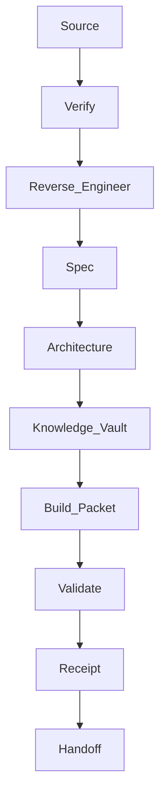

# Design: Reverse Engineering Workflow

## Architecture

The workflow is a documentation and packet-generation lane. It produces artifacts that later builder lanes can consume without needing full chat history or raw source dumps.

## Boundaries

- Researcher owns source inventory, verification, and extraction.
- Policy Guardian owns blocked action review.
- Validator owns local proof.
- Hermes owns next packet routing.
- Codex only builds after a separate file lease.

## Validation

The local validator checks required files, required flow phases, required Build Packet fields, and risky instruction patterns.
