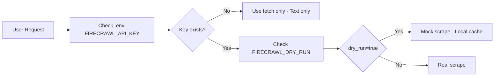

# Firecrawl Dry-Run Script

## วิธีการทดสอบแบบไม่เสียค่าใช้จ่าย

### 1. ใช้ Demo API (ฟรี)
```bash
# Firecrawl มี plan ฟรีสำหรับทดสอบ
# ต้องสมัคร API key ที่ https://firecrawl.dev
```

### 2. Alternative: ใช้ MCP fetch server
```json
{
  "name": "fetch",
  "type": "stdio",
  "command": "npx",
  "args": ["-y", "@modelcontextprotocol/server-fetch"]
}
```

### 3. ระบบ dry-run flow



---

## URLs ที่ควร crawl (ตามข้อมูล)

1. https://github.com/mendableai/firecrawl - Firecrawl repo
2. https://github.com/modelcontextprotocol/servers - MCP servers
3. https://github.com/browseros-ai/BrowserOS - BrowserOS
4. https://github.com/obra/superpowers - Superpowers workflow

---

## Knowledge Base Schema

```sql
CREATE TABLE IF NOT EXISTS web_knowledge (
  id TEXT PRIMARY KEY,
  source_url TEXT NOT NULL,
  title TEXT,
  content TEXT,
  markdown_content TEXT,
  crawled_at TIMESTAMP DEFAULT CURRENT_TIMESTAMP,
  category TEXT,
  tags TEXT
);

CREATE TABLE IF NOT EXISTS knowledge_embeddings (
  id TEXT PRIMARY KEY,
  knowledge_id TEXT REFERENCES web_knowledge(id),
  embedding BLOB,
  model TEXT
);
```

---

## ขั้นตอนถัดไป (ต้องการการอนุมัติ)

- [ ] สมัคร Firecrawl API key (ถ้าจะใช้จริง)
- [ ] หรือใช้แค่ fetch + git clone repos
- [ ] สร้าง script สำหรับ crawl อัตโนมัติ
- [ ] เพิ่ม policy เช็ก robots.txt