# SIRINXDev Grid Mermaid Master Architecture

These diagrams are local architecture knowledge for Obsidian, README, Docs, and FigJam. They are not approval to deploy, push, publish, send Telegram, activate connectors, run real MCP, call paid APIs, or expose secrets.

## 1. Master Grid — SIRINXDev Unified Agent-Native OS

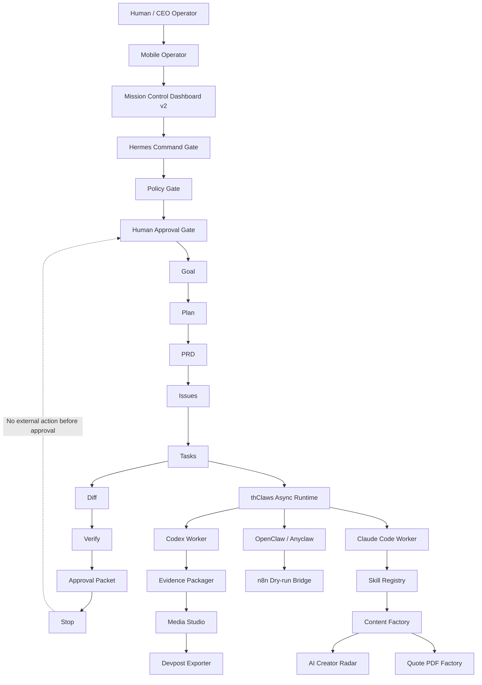

## 2. Local-Only Execution Protocol

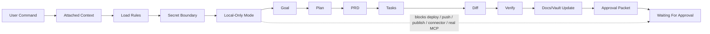

## 3. A2ASync-1CeoAgent SOC Monitor

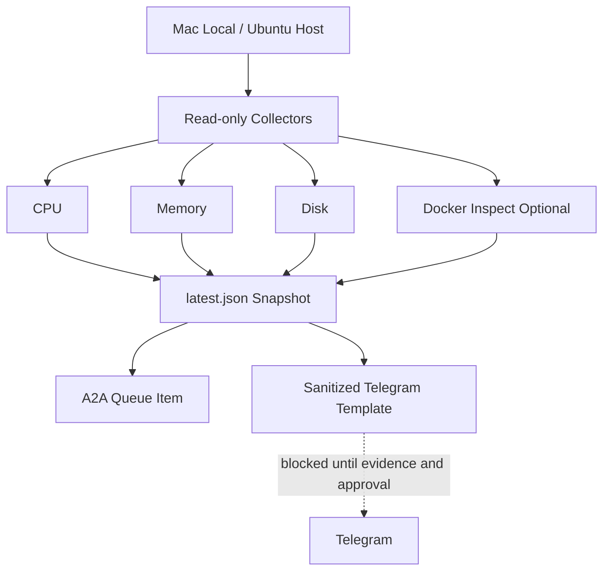

## 4. SOC Capability Boundary

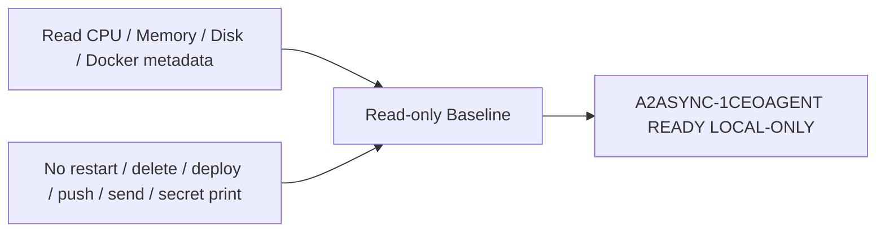

## 5. Full-Stack Monorepo Architecture

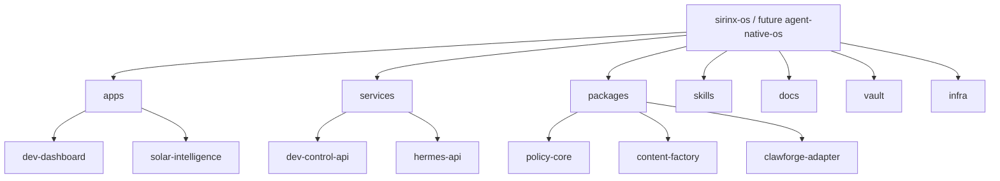

## 6. Part Status Map

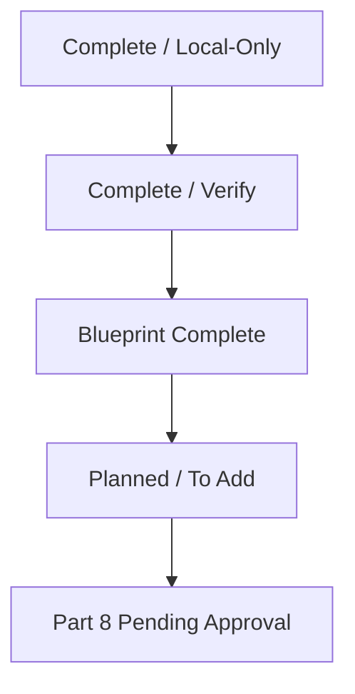

## 7. Model Fusion Decision Layer

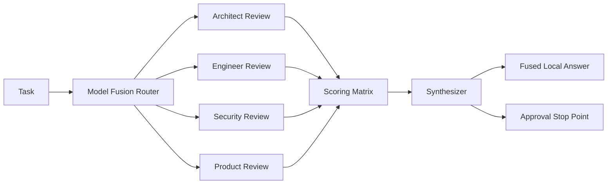

## 8. ClawForge Demo Videos-as-Code Pipeline

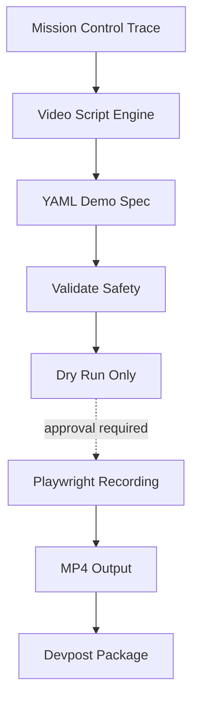

## 9. Telegram / n8n / A2A Orchestration

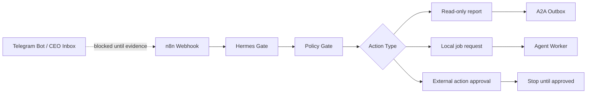

## 10. Compliance And Safety Gate Matrix

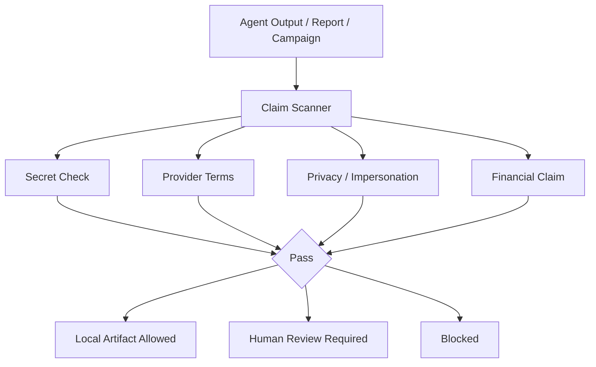

## 11. AI Access Gateway / Credit / Rate Limit

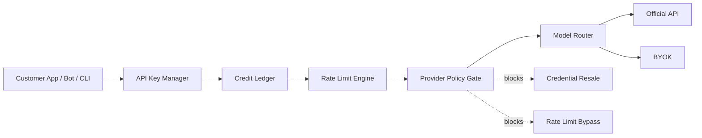

## 12. Obsidian Wiki / Provenance / Knowledge Graph

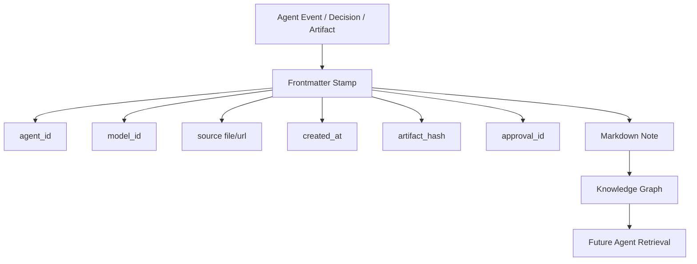

## 13. Full Lifecycle: CEO Command To Telegram SOC

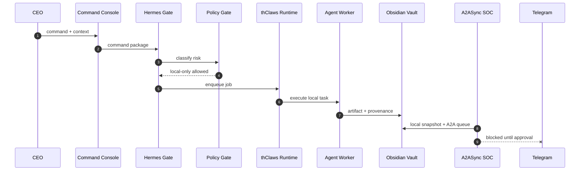

## 14. Professor-Level Concept Map

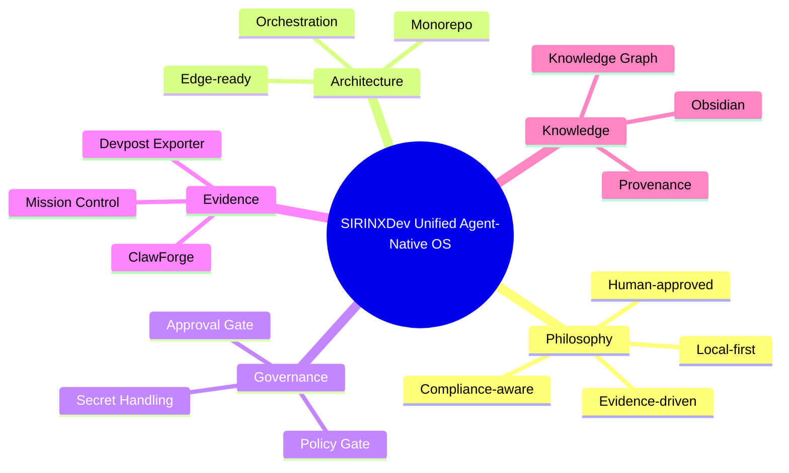

## 15. Deployment Approval Gates

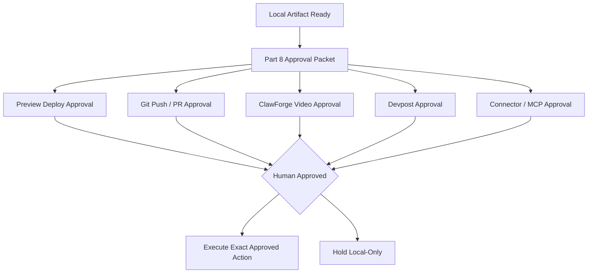

## 16. Master Grid Command

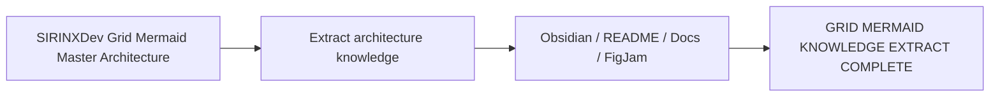

## 17. A2ASync-1CeoAgent Install Path

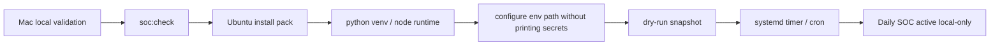

## 18. Architect Summary

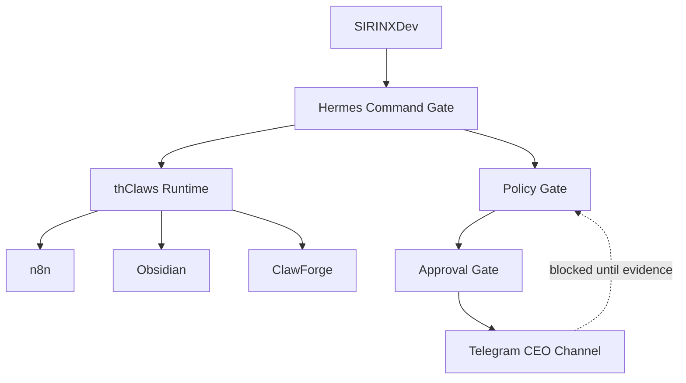
