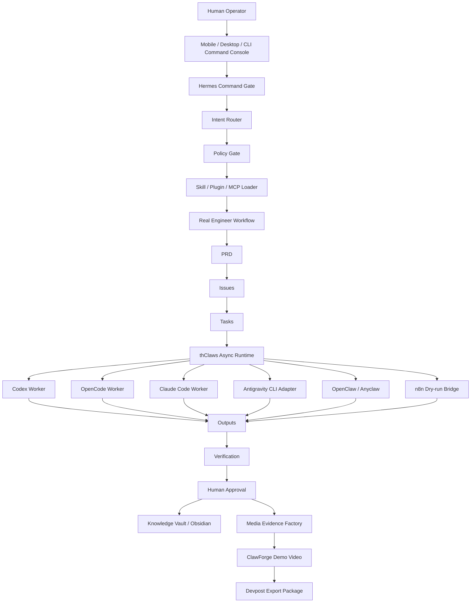

# SirinxMobile — All Knowledge Project Plan

> **SIRINXDev ไม่ใช่ AI coding tool อีกตัว แต่คือศูนย์บัญชาการที่รวม repo, agent, CLI, plugin, skill, MCP, dashboard, mobile operator, content factory, compliance guard, media evidence, ClawForge video pipeline และ hackathon/export pipeline ให้กลายเป็นระบบปฏิบัติการเดียวที่ควบคุมได้**

ลิงก์เปิดใน Obsidian หลังวางไฟล์นี้ไว้ใน vault:

```text
obsidian://open?vault=SIRINXDEV&file=SirinxMobile
```

---

## 0. Universal Safety Lock

ทุก Agent / CLI / Tool / Worker ต้องถือกฎนี้เป็นค่าตั้งต้น:

```text
Goal → Grill Me → Plan → PRD → Issues → Tasks → Diff → Verify → Approval → Vault Update
```

ห้ามทำสิ่งต่อไปนี้โดยไม่มี Human Approval:

```text
NO deploy
NO publish
NO push
NO merge
NO production mutation
NO external connector activation
NO real MCP server execution
NO paid API calls
NO secret / token / .env / keystore exposure
NO account sharing / credential resale / rate-limit bypass
NO dark pattern / fake review / impersonation / private-data scraping
NO Devpost submission / video upload before approval
```

---

# 1. Final Locked Identity

## Product Name

```text
SIRINXDev Unified Agent-Native Monorepo
```

## Operating Name

```text
SIRINXDev Agent-Native Engineering OS
```

## Pitch Line

```text
Most tools give you one AI agent.
SIRINXDev gives you a governed command center for all AI agents.
```

## Thai Pitch Line

```text
เครื่องมือส่วนใหญ่ให้ AI Agent หนึ่งตัว
แต่ SIRINXDev ให้ศูนย์บัญชาการที่ควบคุม AI Agent ทุกตัวอย่างมีระบบ
```

## Scope Lock

รวมเฉพาะงานเทคโนโลยี:

```text
Ghost Claws
SIRINXDev
Hermes / thClaws / OpenClaw
Codex / OpenCode / Claude Code / Antigravity CLI
Mission Control Dashboard
Mobile Operator
AI Access Gateway
Content Factory
ClawForge Demo Videos-as-Code
Devpost / Hackathon Export Pipeline
AI Creator Radar
Compliance Guard
```

ไม่รวมงานบ้านพัก / homestay / retreat / non-tech unless explicitly requested.

---

# 2. Full Phase / Part Status Review

| Phase / Part | สถานะ | รายละเอียด |
|---|---:|---|
| Phase 0 — Blueprint & Architecture | COMPLETE | นิยามระบบ, Monorepo Structure, Migration Map, Agent Worker Layer, Governance Model |
| Part 1 — Monorepo Skeleton | COMPLETE | `apps/`, `packages/`, `skills/`, `docs/`, `vault/`, `legacy/`, `infra/`, `scripts/`, `schemas/`, root configs |
| Part 2 — Hermes + thClaws + CLI Taxonomy | BLUEPRINT COMPLETE | Command Gate, Async Runtime, CLI Command Taxonomy, approval policy |
| Part 3 — OpenClaw / Codex / OpenCode / Claude Code + Plugin/MCP/Skill Governance | BLUEPRINT COMPLETE | Adapter skeletons, registry/policy docs, real execution gated |
| Part 4 — Social Media Agent Layer | COMPLETE — LOCAL ONLY | Brand voices, content skills, publish packet builder, GhostClaws matrix, vault snapshot, publish blocked |
| Part 5 — Mission Control Dashboard v2 | COMPLETE — LOCAL ONLY | Command, Plan, Issues, Agents, Jobs, Outputs, Approvals, Vault, Logs, API CORS + telemetry |
| Part 6 — CLI-Anything Harness + n8n Bridge + Visual Handoff | COMPLETE / VERIFY IN TARGET REPO | CLI route, policy, n8n dry-run, visual handoff, evidence metadata |
| Part 6.5 — Compliance Guard + Ethical Growth Intelligence | ADDED / LOCAL ONLY | Wallet.tg-inspired compliance guard, investor copy rules, Ethical Competitive Intelligence template |
| Part 6.6 — AI Access Gateway / Credit / Rate Limit / Provider Terms Guard | PLANNED / PRE-APPROVAL | Official API/BYOK gateway, credit ledger, usage meter, rate limit, account resale guard |
| Part 7 — Media Evidence Factory + Devpost Exporter | COMPLETE — LOCAL ONLY | Static media studio, video script engine, evidence packager, Devpost draft exporter |
| Part 7.5 — AI Creator Radar / X Intelligence Registry | ADDED — LOCAL ONLY | 15 X accounts as user-seed registry, deterministic signal classifier, no scraping, no impersonation, source verification required |
| Part 7.6 — ClawForge Demo Videos-as-Code Adapter | PACKAGE READY | YAML demo video scripts, dry-run, ClawForge skill, local-only video generation gate |
| Part 7.13 — Ollama Agent Launch Gate | IMPLEMENTED — LOCAL ONLY | Inventories Ollama launch commands, classifies agents as manual-only, blocks auto execution, and gates Hermes routing until context >= 64000 |
| Part 8 — Submit / Preview / External Activation | PENDING APPROVAL | Deploy preview, video upload, Devpost submit, real MCP/plugin/external connectors |

---

# 3. System Architecture



Core formula:

```text
Command → Intent → Skills → PRD → Issues → Jobs → Outputs → Verification → Approval → Vault → Evidence → Devpost
```

---

# 4. GitHub Repo Migration Map

Source repos to unify:

```text
ton36475-lgtm/sirinx
ton36475-lgtm/automation-dashboard
ton36475-lgtm/automation-system-backend
ton36475-lgtm/automation-documentation
ton36475-lgtm/automation-mobile-app
ton36475-lgtm/chokma-growth-os
ton36475-lgtm/automated-marketing-agency
ton36475-lgtm/sirinx-solar-energy
ton36475-lgtm/oz-corp-omega-dual-node
```

| Source Repo | Target Monorepo Area | Role |
|---|---|---|
| `sirinx` | `apps/web-sirinx`, `packages/domain-solar`, `packages/hermes-core`, `skills`, `docs`, `vault` | Core seed, public web, knowledge, governance |
| `automation-dashboard` | `apps/mission-control`, `packages/ui`, `packages/analytics-core` | Mission Control Dashboard |
| `automation-system-backend` | `apps/api`, `packages/automation-core`, `packages/db`, `packages/thclaws-runtime` | Backend/API/runtime seed |
| `automation-documentation` | `docs/architecture`, `docs/prompts`, `docs/research`, `vault/legacy-knowledge` | Prompt vault / architecture docs |
| `automation-mobile-app` | `apps/mobile-operator`, `packages/mobile-ui`, `packages/operator-client` | Mobile operator console |
| `chokma-growth-os` | `apps/web-chokma-growth`, `packages/domain-growth`, `packages/crm-core` | Growth / acquisition vertical |
| `automated-marketing-agency` | `apps/agency-site`, `packages/content-factory`, `packages/campaign-orchestrator` | Marketing agent vertical |
| `sirinx-solar-energy` | `apps/solar-admin`, `apps/solar-customer`, `apps/solar-contractor`, `packages/domain-solar`, `packages/financial-engine` | Solar business vertical |
| `oz-corp-omega-dual-node` | `legacy/`, `docs/research/oz-corp`, `packages/runtime-experiments` | Research/runtime experiments |

Migration rule:

```text
Read-only Audit → Legacy Snapshot → Extract Apps → Extract Packages → Verify → Document → Approval
```

---

# 5. Locked Monorepo Structure

```text
sirinx-agent-native-os/
├─ apps/
│  ├─ web-sirinx/
│  ├─ mission-control/
│  ├─ api/
│  ├─ mobile-operator/
│  ├─ web-chokma-growth/
│  ├─ agency-site/
│  ├─ solar-admin/
│  ├─ solar-customer/
│  ├─ solar-contractor/
│  ├─ docs-site/
│  └─ media-studio/
├─ packages/
│  ├─ ui/ mobile-ui/ types/ config/ db/
│  ├─ hermes-core/ thclaws-runtime/ skill-loader/ policy-gate/
│  ├─ real-engineer-workflow/ agent-team-orchestrator/
│  ├─ automation-core/ analytics-core/ github-integration/
│  ├─ content-factory/ campaign-orchestrator/
│  ├─ quote-engine/ pdf-engine/ crm-core/
│  ├─ domain-growth/ domain-solar/ financial-engine/
│  ├─ operator-client/ n8n-bridge/
│  ├─ openclaw-adapter/ codex-adapter/ opencode-adapter/
│  ├─ antigravity-adapter/ claude-code-adapter/
│  ├─ cli-command-router/ plugin-registry/ plugin-policy/
│  ├─ mcp-registry/ permission-core/ hook-engine/
│  ├─ artifact-store/ diff-engine/ git-ops-guard/
│  ├─ context-manager/ model-router/
│  ├─ video-script-engine/ evidence-packager/ social-video-factory/
│  ├─ devpost-exporter/
│  ├─ clawforge-adapter/
│  ├─ ai-access-gateway/ credit-ledger/ token-cost-engine/
│  └─ rate-limit-engine/ api-key-manager/ usage-meter/ abuse-monitor/
├─ skills/
├─ docs/
├─ vault/
├─ legacy/
├─ infra/
├─ scripts/
├─ schemas/
├─ CLAUDE.md
├─ AGENTS.md
├─ RULES_FOR_CODEX.md
├─ PROJECT_STATE.md
├─ NEXT_ACTIONS.md
├─ pnpm-workspace.yaml
├─ turbo.json
└─ package.json
```

---

# 6. Skills Registry — Current Required Skills

| Skill | Purpose | Status |
|---|---|---|
| `sirinx-karpathy-discipline` | Think before coding, simplicity, surgical changes, verify | skeleton |
| `sirinx-real-engineer-system` | Grill → PRD → Issues → TDD → Review | skeleton |
| `sirinx-code-change-playbook` | Surgical change protocol | skeleton |
| `sirinx-agent-teams-web-factory` | Parallel web factory workflow | skeleton |
| `sirinx-approval-gate` | Human approval stop point | skeleton |
| `sirinx-security-audit` | Secret / token / keystore guard | skeleton |
| `sirinx-compliance-risk-gate` | AML/KYC/Sanctions/SoF and investor copy guard | added |
| `sirinx-growth-hacker` | Ethical Competitive Intelligence only | refactor required |
| `sirinx-content-factory` | Brand voice / publish packet / matrix | complete local-only |
| `sirinx-solar-agent` | Solar domain and financial claim guard | skeleton |
| `sirinx-automation-ops` | Verification stack and handoff | skeleton |
| `sirinx-mobile-operator` | Mobile operator state and UI | skeleton |
| `sirinx-quote-pdf-factory` | Quote/PDF generation | skeleton |
| `sirinx-devpost-submission` | Devpost export and checklist | skeleton |
| `sirinx-antigravity-cli` | Antigravity command mapping | skeleton |
| `sirinx-claude-plugin-marketplace` | Claude plugin governance | skeleton |
| `sirinx-plugin-governance` | Trust tiers, manifest, permissions | skeleton |
| `sirinx-mcp-permission-gate` | MCP server default-deny gate | skeleton |
| `sirinx-demo-video-factory` | Demo media evidence | skeleton |
| `sirinx-devpost-gallery` | Devpost gallery assets | skeleton |
| `sirinx-cli-command-taxonomy` | Unified slash command map | skeleton |
| `sirinx-cli-anything-harness` | CLI harness + n8n dry-run | complete/verify |
| `sirinx-x-ai-radar` | X creator radar registry | to add |
| `sirinx-creator-signal-extractor` | Extract public creator signals ethically | to add |
| `sirinx-trend-to-content-pipeline` | Turn trends into content packets | to add |
| `sirinx-clawforge-demo-video` | Generate demo videos as code | package ready |
| `sirinx-ai-access-compliance` | AI access gateway compliance | planned |

---

# 7. CLI / Plugin / MCP Governance

## Antigravity / Generic Agent CLI Taxonomy

```text
Workspace: /add-dir, /agents, /ask, /clear
Config: /config, /model, /mcp, /permissions, /hooks, /theme
Files: /artifact, /context, /copy, /diff, /open, /rename
Planning: /goal, /grill-me, /planning, /tasks, /schedule, /resume, /rewind
Git: /status, /diff, /commit, /push, /pull, /changelog
Improve: /skills, /practice, /improve, /explain, /code-review, /optimize
```

Rules:

```text
/diff before /commit
/push requires human approval
/model switch must be logged
/mcp requires manifest and permission map
/hooks default-deny if mutating files
/community plugin = sandbox-only
```

## Plugin Trust Tiers

```text
Tier 0: Internal SIRINX Skills — allowed in sandbox/staging after review
Tier 1: Official / Verified Plugins — manifest review required
Tier 2: Community Plugins — sandbox-only, no secrets, no auto-run hooks
Tier 3: Unknown / Experimental — research/read-only only
```

---

# 8. Part 4 — Social Media Agent Layer

Status:

```text
COMPLETE — LOCAL ONLY
```

Delivered:

```text
6 brand voices
14 content skills
templates
manual publish packet builder
visual QA
Telegram bridge concept blocked
30-day GhostClaws content matrix seed
vault snapshot without token/config
```

Boundary:

```text
No publish
No Telegram send
No external analytics connector
No platform automation
```

---

# 9. Part 5 — Mission Control Dashboard v2

Status:

```text
COMPLETE — LOCAL ONLY
```

Tabs:

```text
Command
Plan / PRD
Issues
Agents
Jobs
Outputs
Approvals
Vault
Logs
```

Local endpoints:

```text
API: http://localhost:3001
Mission Control: http://localhost:3000
```

API features:

```text
/api/command
/api/dashboard/status
/api/approvals
telemetry aggregate
approve/reject local job record
CORS for local dashboard
```

---

# 10. Part 6 — CLI-Anything Harness + n8n Bridge + Visual Handoff

Status:

```text
COMPLETE / VERIFY IN TARGET REPO
```

Delivered:

```text
cli-anything-harness route/policy/workflow dry-run/artifact metadata
n8n bridge skeleton / dry-run
visual handoff markdown
evidence-packager integration
run-demo includes Part 6 output
runtime entrypoints changed from dist to source where needed
```

Closeout docs:

```text
docs/approvals/PART_6_CLOSEOUT.md
vault/projects/sirinx-agent-native-os/PART_6_HANDOFF.md
docs/engineering/CLI_ANYTHING_HARNESS_VISUAL_HANDOFF.md
```

---

# 11. Part 6.5 — Compliance Guard + Ethical Growth Intelligence

Status:

```text
ADDED — LOCAL ONLY
```

Purpose:

```text
Use transaction/compliance references as guardrails only, never bypass guidance.
```

Rules:

```text
NO “no KYC” claims
NO AML bypass
NO sanctioned exchange acceptance claims
NO guaranteed deposit/withdrawal
NO freeze recovery guarantee
NO dark pattern marketing
NO fake reviews
NO impersonation
NO private data scraping
```

Ethical Competitive Intelligence fallback:

```text
Evidence missing — competitor discovery required from public sources.
```

Vault:

```text
vault/projects/phitsanulok-growth-intel/
```

---

# 12. Part 6.6 — AI Access Gateway / Credit / Rate Limit / Terms Guard

Status:

```text
PLANNED — PRE-APPROVAL
```

Safe framing:

```text
SIRINX is not an AI account reseller.
It is a governed AI access gateway for teams, developers, and businesses.
```

Allowed:

```text
AI Workspace Setup & Management
BYOK
Official API routing
Credit ledger
Token/cost meter
Rate limiter
Abuse monitor
Customer dashboard
Provider terms risk gate
```

Blocked:

```text
consumer account sharing
credential resale
subscription pooling
service credit transfer/resale
rate-limit bypass
programmatic extraction from consumer UI
fake unlimited usage claims
bot click / ad fraud / fake engagement
```

Packages planned:

```text
ai-access-gateway
provider-adapter-registry
credit-ledger
token-cost-engine
rate-limit-engine
api-key-manager
usage-meter
billing-risk-gate
abuse-monitor
account-workspace-manager
customer-dashboard-core
```

---

# 13. Part 7 — Media Evidence Factory + Devpost Exporter

Status:

```text
COMPLETE — LOCAL ONLY
```

Chosen approach:

```text
apps/media-studio = static shell pattern
not Vite
no dependency graph churn
```

Delivered:

```text
apps/media-studio
packages/video-script-engine
packages/evidence-packager
packages/devpost-exporter
scripts/build-devpost-package.mjs
scripts/export-devpost-package.mjs
scripts/run-demo.mjs
docs/media/*
docs/hackathons/DEVPOST_FIELD_DRAFT.md
vault/outputs/devpost-package/
```

Artifacts:

```text
vault/outputs/devpost-package/devpost-submission.json
vault/outputs/devpost-package/devpost-submission.md
```

Boundary:

```text
No upload
No publish
No deploy
No push
No Devpost submit
```

---

# 14. Part 7.5 — AI Creator Radar / X Intelligence Registry

Status:

```text
ADDED — LOCAL ONLY
```

Seed accounts:

```text
@karpathy
@steipete
@gregisenberg
@rileybrown
@jackfriks
@levelsio
@marclou
@EXM7777
@eptwts
@godofprompt
@vasuman
@AmirMushich
@0xROAS
@egeberkina
@MengTo
```

Important rule:

```text
Labels like “ราชาแห่ง...” are internal user-provided labels, not verified factual titles.
```

Files to create:

```text
vault/research/x-ai-radar/AI_X_ACCOUNTS_SEED.md
vault/research/x-ai-radar/CREATOR_SIGNAL_MAP.md
vault/research/x-ai-radar/WEEKLY_AI_RADAR_TEMPLATE.md
vault/research/x-ai-radar/CONTENT_INSPIRATION_LOG.md
vault/research/x-ai-radar/SOURCE_VERIFICATION_LOG.md
docs/research/AI_CREATOR_SIGNAL_MAP.md
docs/research/X_SOURCE_ETHICS_POLICY.md
skills/sirinx-x-ai-radar/SKILL.md
skills/sirinx-creator-signal-extractor/SKILL.md
skills/sirinx-trend-to-content-pipeline/SKILL.md
packages/content-factory/src/intelligence/xAccounts.ts
packages/content-factory/src/intelligence/signalClassifier.ts
packages/content-factory/src/intelligence/weeklyRadar.ts
```

Implemented in target repo `/Users/sirinx/sirinx-os` with `.mjs` modules to match the repo runtime:

```text
packages/content-factory/src/intelligence/xAccounts.mjs
packages/content-factory/src/intelligence/signalClassifier.mjs
packages/content-factory/src/intelligence/weeklyRadar.mjs
packages/content-factory/src/intelligence/xAccounts.ts
packages/content-factory/src/intelligence/signalClassifier.ts
packages/content-factory/src/intelligence/weeklyRadar.ts
scripts/check-x-ai-radar.mjs
```

Ethics:

```text
No scraping private data
No impersonation
No copying posts directly
No fake quote
No endorsement claim
No X automation without approval
```

---

# 15. Part 7.6 — ClawForge Demo Videos-as-Code Adapter

Status:

```text
PACKAGE READY — LOCAL ONLY
```

Purpose:

```text
Mission Control / CLI Harness / Evidence Packager / Devpost Exporter
→ YAML demo script
→ Playwright browser recording
→ edge-tts voiceover
→ ffmpeg MP4
→ Evidence Bundle
→ Devpost Package
```

Files prepared in integration pack:

```text
docs/integrations/CLAWFORGE_ADAPTER_PLAN.md
docs/approvals/PART_7_6_CLAWFORGE_PROPOSAL.md
skills/sirinx-clawforge-demo-video/SKILL.md
packages/clawforge-adapter/package.json
packages/clawforge-adapter/src/index.ts
packages/clawforge-adapter/src/validateDemoSpec.mjs
examples/clawforge/sirinx-mission-control-demo.yaml
scripts/run-clawforge-dry-run.mjs
vault/projects/sirinx-agent-native-os/SirinxMobile.md
```

Validate-only commands:

```bash
clawforge check-deps
clawforge validate examples/clawforge/sirinx-mission-control-demo.yaml
```

Generate real video only after approval:

```bash
clawforge examples/clawforge/sirinx-mission-control-demo.yaml
```

ClawForge safety boundary:

```text
Target localhost/demo-safe URLs only
No billing/API key/private message/customer data capture
No public upload
No Devpost submit
No screen capture of secrets
```

Strategic line:

```text
SIRINXDev governs the agents.
ClawForge lets the agents produce the proof.
```

---

# 16. Part 8 — Submit / Preview / External Activation

Status:

```text
PENDING APPROVAL
```

Approval required for:

```text
Deploy preview
Push branch
Create PR
Submit Devpost
Upload video
Publish social content
Activate real MCP server
Install Claude/Antigravity plugin
Connect external connector
Run paid API
```

Part 8 proposed flow:

```text
1. Re-run full verification
2. Capture real screenshots SH-01..SH-10
3. Validate ClawForge YAML
4. Generate local MP4 demo if approved
5. Human review Devpost markdown
6. Deploy preview only if approved
7. Upload video only if approved
8. Submit Devpost only if approved
```

Split approval files:

```text
docs/approvals/PREVIEW_DEPLOY_APPROVAL.md
docs/approvals/GIT_PUSH_PR_APPROVAL.md
docs/approvals/CLAWFORGE_VIDEO_GENERATION_APPROVAL.md
docs/approvals/DEVPOST_SUBMISSION_APPROVAL.md
docs/approvals/EXTERNAL_CONNECTOR_MCP_APPROVAL.md
```

---

# 17. Mobile / Anyclaw / Yoragpt Operating Notes

Use mobile / Anyclaw / Yoragpt as command console, not production deployer.

Recommended tools:

```text
Token Counter & Cost
Rate Limiter
Save as File
URL Reader
Web Search
Conversation Trim
Credit Limit per model
Date & Time
Calculator
```

Use with care:

```text
Auto Memory — only personal vault/project memory
YouTube Transcript — summary only, copyright-aware
Reasoning Display — concise rationale only, no hidden chain-of-thought
Code Download — local artifact only
```

Blocked without approval:

```text
external API key storage
production connector
public publish
account proxying
credential sharing
real MCP server execution
```

---

# 18. Current Execution Commands

Full verification:

```bash
pnpm verify:workspace
pnpm audit:secrets
pnpm check
pnpm soc:check
pnpm soc:test
pnpm run demo
pnpm export:devpost
```

Node fallback verification:

```bash
node scripts/verify-workspace.mjs
node scripts/secret-scan.mjs
node scripts/check-skeleton.mjs
node scripts/check-soc-monitor.mjs
node scripts/run-demo.mjs
node scripts/export-devpost-package.mjs
```

ClawForge dry-run / validate:

```bash
node scripts/run-clawforge-dry-run.mjs
clawforge check-deps
clawforge validate examples/clawforge/sirinx-mission-control-demo.yaml
```

---

# 18.5 Full Local OS / SOC Truth Extension

Status:

```text
IMPLEMENTED — LOCAL ONLY
```

Canonical files:

```text
docs/knowledge/SIRINX_FULL_LOCAL_OS_IMPLEMENTATION_2026-05-26.md
docs/knowledge/system-wiring/sirinx-full-local-os-lanes.md
vault/projects/sirinx-agent-native-os/SIRINXDEV_GRID_MERMAID_MASTER_ARCHITECTURE.md
```

Local commands:

```bash
pnpm soc:check
pnpm soc:test
pnpm soc:dry-run
```

Rules:

```text
SOC v1 is read-only by default.
Telegram delivery is blocked until recipient/token evidence and exact send approval exist.
Reports must label claims as observed, template, blocked, or not_run.
No deploy, push, publish, connector activation, real MCP, paid API, production write, or secret exposure is allowed by this extension.
```

Stop:

```text
FULL LOCAL OS IMPLEMENTED — LOCAL ONLY — WAITING FOR PART 8 APPROVAL
```

---

# 18.6 Part 7.13 — Ollama Agent Launch Gate

Status:

```text
IMPLEMENTED — LOCAL ONLY
```

Local commands inventoried:

```text
ollama launch claude
ollama launch codex-app
ollama launch hermes
ollama launch openclaw
ollama launch opencode
ollama launch codex
ollama launch copilot
ollama launch droid
ollama launch pi
```

Rules:

```text
All agents are manual_only.
No API route or dashboard panel may execute ollama launch.
Hermes routing stays blocked until context window >= 64000.
Codex App and Codex are the first manual smoke candidates.
No deploy, push, publish, real MCP, connector activation, paid API, message send, or secret read is allowed.
```

Local API:

```bash
GET /api/agent-launch-gate
POST /api/agent-launch-gate/plan/dry-run
pnpm agent-launch-gate:test
```

Stop:

```text
OLLAMA AGENT LAUNCH GATE READY — LOCAL ONLY — WAITING FOR MANUAL SMOKE APPROVAL
```

---

# 19. Master Pattern Prompt — Continue From Here

```text
/patternpromptcommand sirinxmobile-continue-all-knowledge-plan

Role:
Lead Migration + Architecture + Governance + Compliance + Media Evidence Agent for SIRINXDev Unified Agent-Native Monorepo

Mission:
Continue from the current SirinxMobile state, keeping all actions local-only until Part 8 approval.

Current State:
- Part 4 complete local-only
- Part 5 complete local-only
- Part 6 complete / verify in target repo
- Part 6.5 compliance guard added
- Part 6.6 AI access gateway planned
- Part 7 complete local-only
- Part 7.5 AI Creator Radar added local-only
- Part 7.6 ClawForge adapter package ready
- Part 7.13 Ollama Agent Launch Gate implemented local-only
- Part 8 pending approval

Tasks:
1. Verify target repo state.
2. Add Part 7.5 AI Creator Radar registry local-only.
3. Validate Part 7.6 ClawForge YAML without generating public video.
4. Update SirinxMobile.md and vault notes.
5. Prepare Part 8 Approval Packet.
6. Keep Ollama launch commands as manual-only; do not auto-execute.
7. Stop before deploy/push/publish/upload/submit.

Blocked:
- deploy
- push
- publish
- upload
- Devpost submission
- external connector activation
- paid API
- real MCP execution
- secret exposure
- private data scraping
- impersonation

Stop:
SIRINX MOBILE KNOWLEDGE UPDATED — LOCAL ONLY — WAITING FOR PART 8 APPROVAL
```

---

# 20. Next Action Queue

## Immediate — Local Only

```text
1. Put this file into Obsidian vault: SIRINXDEV/SirinxMobile.md — DONE
2. Add Part 7.5 AI Creator Radar files — DONE LOCAL ONLY
3. Run node fallback verification — DONE
4. Run pnpm verification if repo dependencies are available — DONE
5. Validate ClawForge demo YAML only — DONE
6. Prepare Part 8 Approval Packet — DONE LOCAL ONLY
7. Add Ollama Agent Launch Gate — DONE LOCAL ONLY
```

## Approval Required

```text
1. Generate real ClawForge MP4
2. Deploy preview
3. Push branch / create PR
4. Upload demo video
5. Submit Devpost
6. Activate MCP/plugin/external connectors
7. Publish campaign content
8. Run real Ollama agent launch smoke tests
```

---

# 21. Universal Stop Point

```text
SIRINX MOBILE KNOWLEDGE UPDATED — LOCAL ONLY — WAITING FOR PART 8 APPROVAL
```
