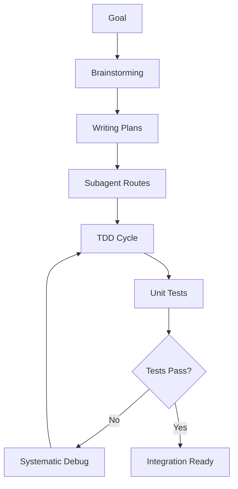

# obra/superpowers Workflow

## โซยะางงาน 5 สกิลหลัก

### Phase 1: Brainstorming (สัมภาษณ์และออกแบบ)
- ถามผู้ใช้ 2-3 ข้อ
- สร้าง Design Document
- เสนอ Visual Companion ถ้าจำเป็น

### Phase 2: Writing Plans (แผนการทำงาน)
- แตกงานใหญ่เป็นงานย่อย ๆ
- ระบุไฟล์ที่ต้องแก้
- กำหนดวิธีทดสอบ

### Phase 3: Subagent Development
- สร้าง Subagent แยกกันทำแต่ละ Task
- Reviewer Subagent ตรวจผล
- แก้ไขจนกว่าจะผ่าน

### Phase 4: Test Driven Development
- เขียน Test ก่อน Production Code
- บังคับ RED-GREEN-REFACTOR
- ห้ามแอบเขียนโค้ดโดยไม่มี Test

### Phase 5: Systematic Debugging
- 4 Phase การสืบสวน
- หา Root Cause ก่อนแก้
- หยุดถ้าแก้ 3 ครั้งไม่หาย แล้วกลับไปทำ架构ใหม่

---

## การปรับใช้กับ sirinx-os



### Command Interface
```
/solar [goal]           → เริ่ม solar workflow
/automation [goal]      → เริ่ม automation workflow
/research [topic]       → เริ่ม research workflow
/debug [issue]          → เริ่ม debug workflow
```

---

## ตัวอย่างการใช้งาน

### Goal: เพิ่ม Knowledge Base จากเว็บไซต์
1. Brainstorming: ถามผู้ใช้แหล่งที่มา, ประเภทข้อมูล
2. Writing Plans: แผน scrape → process → store → serve
3. Subagent: 
   - firecrawl-scraper agent
   - data-processor agent
   - vector-store agent
4. TDD: เขียน test สำหรับแต่ละขั้นตอน
5. Debug: ถ้า scrape ไม่ได้, ตรวจ robots.txt, rate limiting